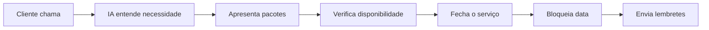

# 🤖 Luv - IA Atendente Comercial Virtual

> **Assistente comercial inteligente para fotógrafos e prestadores de serviço**

---

## 🎯 Objetivo do Projeto

Criar uma IA atuando como **atendente comercial virtual**, capaz de conduzir o cliente do primeiro contato até o fechamento do serviço, com integração direta à agenda do profissional.

### Foco Principal
- ✅ Reduzir o gargalo de atendimento
- ✅ Automatizar tarefas operacionais
- ✅ Aumentar a taxa de conversão
- ✅ Manter o controle final com o profissional

---

## 💬 Função Principal da IA (Atendente Virtual)

A IA será responsável por:

1. **Iniciar e conduzir o atendimento automaticamente**
   - WhatsApp, Instagram ou outro canal

2. **Entender a necessidade do cliente**
   - Tipo de ensaio
   - Data
   - Local
   - Duração

3. **Apresentar serviços, pacotes e valores**

4. **Responder dúvidas frequentes com linguagem natural**

5. **Enviar arquivos**
   - Portfólio
   - Proposta
   - Contrato
   - Termos
   - PDFs

6. **Conduzir o cliente até o fechamento do serviço**

> ⚠️ **Observação importante:** O profissional sempre terá acesso para conferência final e ajustes manuais.

---

## 📅 Integração com Calendário e Agenda

### Integração Inteligente

Ao identificar o fechamento do serviço, a IA deverá:

```
✓ Verificar disponibilidade no calendário
✓ Bloquear automaticamente o horário
✓ Criar o evento com informações completas
```

#### Informações do Evento
- Nome do cliente
- Contato
- Tipo de serviço
- Observações importantes

### Funcionalidades de Agenda

**Plataforma totalmente manuseável pelo profissional**

O profissional poderá:
- 🔄 Desmarcar ou remarcar atendimentos
- 🚫 Bloquear datas e horários indisponíveis
- ✏️ Editar informações do evento manualmente

---

## 💰 Pagamentos e Confirmação

### Capacidades da IA

A IA poderá:

| Ação | Descrição |
|------|-----------|
| 💵 Informar valores | Apresentar preços e formas de pagamento |
| 📤 Enviar dados | Pix, link de pagamento, etc. |
| 📥 Solicitar comprovante | Receber e identificar automaticamente |
| ⏳ Marcar status | "Aguardando conferência" |

> ✅ **Importante:** O status só muda para **confirmado** após validação do profissional (ou regra definida).

---

## 🔔 Notificações e Comunicação Interna

### Notificações Automáticas

A cada ação importante, a IA deverá enviar notificação para o profissional quando:

- 🎉 Um serviço for fechado
- 💳 Um pagamento for enviado
- 📆 Houver alteração de data ou horário

**Opcional:** Enviar notificação para um contato cadastrado a cada fechamento

---

## ⏰ Lembretes e Rotinas Automáticas

### Para o Cliente

**Enviar lembretes automáticos antes do ensaio:**
- ⏱️ 48h antes
- ⏱️ 24h antes

**Incluindo informações:**
- 📅 Data
- 🕐 Horário
- 📍 Local
- 📋 Orientações pré-ensaio

### Para o Profissional

**Opções de agendamento:**

```
Opção 1: Agenda do dia no início da manhã
Opção 2: Agenda do dia seguinte na noite anterior
```

> ⚙️ **Configurável:** Horário totalmente ajustável pelo profissional

---

## 🎛️ Painel do Profissional (Gestão)

### Funcionalidades da Plataforma

A plataforma deverá permitir:

#### Visualização e Acompanhamento
- 👥 Visualizar todos os atendimentos
- 📊 Acompanhar status dos leads:
  - Em atendimento
  - Fechado
  - Pendente
  - Cancelado

#### Edição Manual
- ✏️ Editar qualquer informação manualmente

#### Definição de Regras de Atendimento
- 🕐 Horários ativos da IA
- 📸 Tipos de serviço
- 💵 Valores
- 📝 Textos padrão
- 💬 Tom de comunicação

---

## 💡 Sugestões e Melhorias Estratégicas

### 1. Começar Semi-Automático (Mais Viável)

**Fluxo recomendado:**
1. IA conduz o atendimento
2. Fechamento sinalizado como "pré-confirmado"
3. Profissional valida com 1 clique

> ✅ **Vantagem:** Menos risco, mais controle

### 2. Posicionamento do Produto

❌ **NÃO vender como:** "Robô"

✅ **Vender como:** "Assistente comercial inteligente para fotógrafos e prestadores de serviço"

### 3. Diferencial Competitivo

| Diferencial | Benefício |
|------------|-----------|
| ⚡ SLA de resposta instantânea | Atendimento imediato |
| 🌙 Atendimento 24/7 | Nunca perde leads |
| 🎯 Zero leads perdidos | Máxima conversão |
| 🔗 Integração total com agenda | Organização automática |

### 4. Público Ideal Inicial

**Personas principais:**
- 📸 Fotógrafos
- 🏢 Estúdios
- 🎬 Videomakers
- 💼 Profissionais autônomos com agenda
  - Estética
  - Vídeo
  - Consultoria

---

## 🎯 Frase-Chave do Projeto

> **"A IA não substitui o profissional — ela protege o tempo dele."**

---

# 🚀 PITCH DE APRESENTAÇÃO

## 😓 O Problema

Profissionais como fotógrafos **perdem vendas todos os dias** não por falta de talento, mas por **falta de tempo**.

### Eles fazem tudo sozinhos:
- 💬 Atendimento
- 💰 Orçamento
- 📅 Agenda
- ✂️ Edição
- 📦 Entrega

### O Resultado?
- 🐌 Respostas demoradas
- ❄️ Leads esfriando
- 📆 Datas mal organizadas
- 💸 Vendas perdidas sem nem perceber

---

## ✨ A Solução

Criamos uma **IA atendente comercial inteligente**, que cuida de todo o processo de atendimento, do primeiro contato até o fechamento do serviço.

### O que ela faz:
- 🌙 Atende **24/7**
- ⚡ Responde **instantaneamente**
- 📄 Envia **propostas**
- 📅 Agenda **datas**
- 💳 Solicita **pagamento**
- 🗂️ Organiza tudo **automaticamente** na agenda do profissional

> **O profissional só entra para validar e executar.**

---

## ⚙️ Como Funciona



**Passo a passo:**

1. 📱 O cliente chama no WhatsApp ou Instagram
2. 🤖 A IA entende a necessidade
3. 📋 Apresenta pacotes e valores
4. 📅 Verifica disponibilidade na agenda
5. ✅ Fecha o serviço
6. 🔒 Bloqueia a data automaticamente
7. 🔔 Envia lembretes e notificações

**Tudo integrado em uma única plataforma.**

---

## 🏆 Diferencial Competitivo

| Característica | Benefício |
|----------------|-----------|
| ⚡ Atendimento imediato | Zero leads perdidos |
| 🔗 Integração inteligente | Agenda sincronizada |
| 🎯 Fechamento sem fricção | Mais conversões |
| 🔔 Lembretes automáticos | Profissionalismo |
| 🎛️ Controle total | Autonomia do profissional |

### Não é um robô.
### É um assistente comercial digital.

---

## 🎯 Público-Alvo Inicial

**Segmentos prioritários:**

1. 📸 **Fotógrafos**
2. 🏢 **Estúdios**
3. 🎬 **Videomakers**
4. 💼 **Profissionais autônomos que vendem por agenda**

---

## 🎁 Benefícios Diretos

### Para o Negócio
- 📈 **Mais conversões**
- ⚡ **Menos retrabalho**
- 📅 **Agenda organizada**

### Para o Profissional
- ⏰ **Tempo livre para produzir melhor**
- 📊 **Escala sem contratar equipe**

---

## 💥 Frase de Impacto

> # **"Enquanto você fotografa, a IA vende por você."**

---

## 📊 Resumo Executivo

### MVP Recomendado

**Fase 1 - Semi-Automático:**
- ✅ IA conduz atendimento completo
- ✅ Pré-confirmação automática
- ✅ Validação manual em 1 clique
- ✅ Integração com WhatsApp
- ✅ Agenda básica

**Fase 2 - Expansão:**
- 🔄 Multi-canal (Instagram, site)
- 🤖 Automação de pagamentos
- 📊 Analytics e relatórios
- 🎨 Personalização de marca

### Métricas de Sucesso

| Métrica | Meta |
|---------|------|
| Taxa de resposta | < 1 minuto |
| Disponibilidade | 24/7 (99.9% uptime) |
| Conversão | +30% vs manual |
| Tempo economizado | 10-15h/semana |

---

**Documento criado em:** 2026-01-23  
**Versão:** 1.0  
**Status:** MVP em planejamento