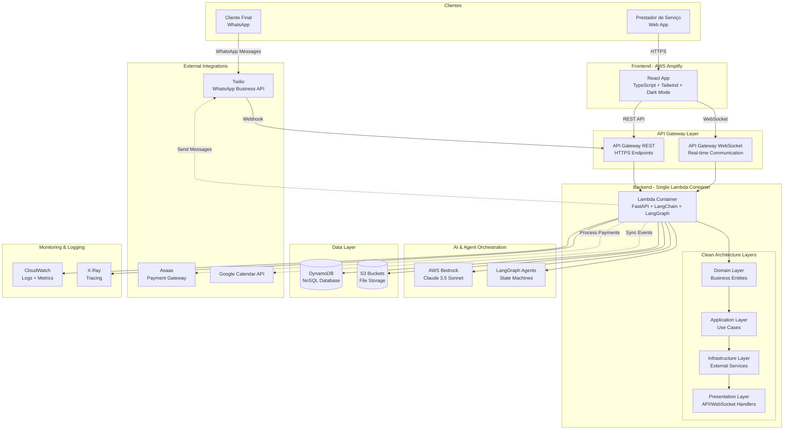
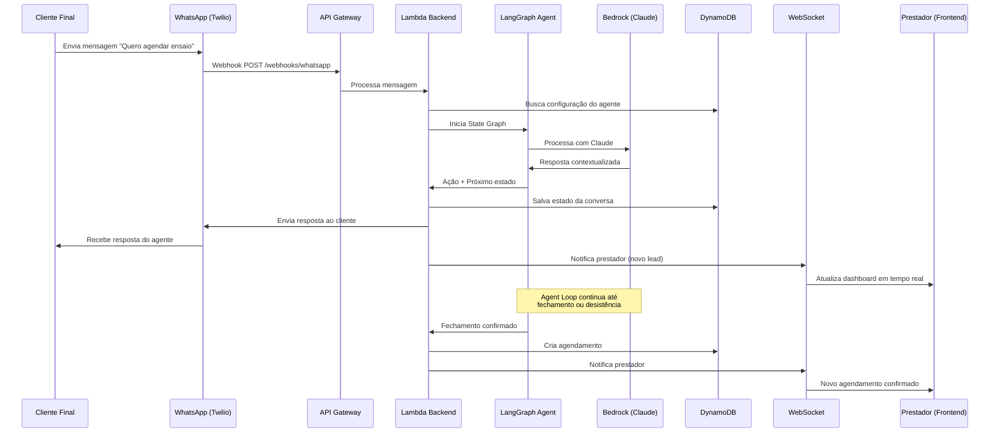
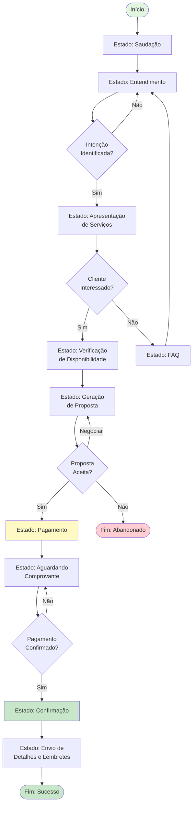

# 🏗️ Luv - DOCUMENTAÇÃO TÉCNICA COMPLETA

> **Prompt de Arquitetura e Implementação Técnica**  
> Stack: Python + LangGraph + AWS Serverless + React + TypeScript + Terraform

---

## 📑 SUMÁRIO EXECUTIVO

Este documento serve como especificação técnica completa e prompt de implementação para o **Luv** - uma plataforma B2B2C SaaS de atendimento comercial automatizado via IA para fotógrafos e prestadores de serviço.

### Stack Tecnológica Core

```yaml
Backend:
  - Linguagem: Python 3.12
  - Framework: FastAPI + Mangum (Lambda adapter)
  - AI/Agents: LangChain + LangGraph + AWS Bedrock (Claude 3.5 Sonnet)
  - Arquitetura: Clean Architecture (Uncle Bob)
  - Deploy: AWS Lambda (Container-based)

Frontend:
  - Framework: React 18 + TypeScript
  - Styling: TailwindCSS + CSS Variables (Dark Mode)
  - State: Zustand + React Query
  - Forms: React Hook Form + Zod
  - Deploy: AWS Amplify

Infrastructure:
  - IaC: Terraform (modular)
  - CI/CD: GitHub Actions
  - Containers: Docker + AWS ECR
  - Database: DynamoDB
  - Storage: S3
  - API: API Gateway (REST + WebSocket)

Integrations:
  - WhatsApp: Twilio API
  - Payments: Asaas API
  - Calendar: Google Calendar API + Internal Calendar
  - AI: AWS Bedrock (Claude 3.5 Sonnet)
```

---

## 🎯 ARQUITETURA GERAL DO SISTEMA

### Diagrama de Arquitetura High-Level



### Fluxo de Atendimento (Cliente Final → Prestador)



---

## 🐍 BACKEND - ARQUITETURA LIMPA DETALHADA

### Estrutura de Diretórios Completa

```
backend/
├── src/
│   ├── domain/                                    # 🎯 CAMADA DE DOMÍNIO
│   │   ├── __init__.py
│   │   │
│   │   ├── entities/                              # Entidades de Negócio
│   │   │   ├── __init__.py
│   │   │   ├── professional.py                    # Entidade Profissional
│   │   │   ├── client.py                          # Entidade Cliente
│   │   │   ├── appointment.py                     # Entidade Agendamento
│   │   │   ├── service.py                         # Entidade Serviço
│   │   │   ├── service_package.py                 # Pacotes de Serviços
│   │   │   ├── payment.py                         # Entidade Pagamento
│   │   │   ├── conversation.py                    # Conversa/Atendimento
│   │   │   ├── agent_config.py                    # Configuração do Agente
│   │   │   └── notification.py                    # Notificação
│   │   │
│   │   ├── value_objects/                         # Value Objects
│   │   │   ├── __init__.py
│   │   │   ├── cpf.py
│   │   │   ├── cnpj.py
│   │   │   ├── email.py
│   │   │   ├── phone.py
│   │   │   ├── money.py
│   │   │   ├── address.py
│   │   │   ├── time_slot.py                       # Horário de disponibilidade
│   │   │   └── notification_config.py             # Config 15/30/45/60 min
│   │   │
│   │   ├── enums/                                 # Enumerações
│   │   │   ├── __init__.py
│   │   │   ├── appointment_status.py              # pending, confirmed, cancelled, completed
│   │   │   ├── payment_status.py                  # pending, paid, refunded
│   │   │   ├── service_type.py                    # photography, video, etc
│   │   │   ├── conversation_status.py             # active, closed, abandoned
│   │   │   └── notification_type.py               # email, whatsapp, push
│   │   │
│   │   └── repositories/                          # Interfaces (Ports)
│   │       ├── __init__.py
│   │       ├── professional_repository.py
│   │       ├── client_repository.py
│   │       ├── appointment_repository.py
│   │       ├── service_repository.py
│   │       ├── payment_repository.py
│   │       ├── conversation_repository.py
│   │       ├── agent_config_repository.py
│   │       └── notification_repository.py
│   │
│   ├── application/                               # 🎯 CAMADA DE APLICAÇÃO
│   │   ├── __init__.py
│   │   │
│   │   ├── use_cases/                             # Casos de Uso
│   │   │   ├── __init__.py
│   │   │   │
│   │   │   ├── professional/
│   │   │   │   ├── __init__.py
│   │   │   │   ├── create_professional.py
│   │   │   │   ├── update_professional.py
│   │   │   │   ├── update_agent_config.py         # Configurar agente
│   │   │   │   ├── manage_availability.py         # Gerenciar disponibilidade
│   │   │   │   ├── manage_services.py             # CRUD de serviços
│   │   │   │   └── get_professional_stats.py      # Dashboard stats
│   │   │   │
│   │   │   ├── appointment/
│   │   │   │   ├── __init__.py
│   │   │   │   ├── create_appointment.py
│   │   │   │   ├── confirm_appointment.py         # Confirmar após pagamento
│   │   │   │   ├── reschedule_appointment.py
│   │   │   │   ├── cancel_appointment.py
│   │   │   │   ├── list_appointments.py
│   │   │   │   └── check_availability.py          # Tool para agente
│   │   │   │
│   │   │   ├── agent/                             # Casos de uso do agente
│   │   │   │   ├── __init__.py
│   │   │   │   ├── handle_customer_message.py     # Processar mensagem
│   │   │   │   ├── generate_proposal.py           # Gerar proposta
│   │   │   │   ├── send_proposal.py               # Enviar proposta
│   │   │   │   ├── process_payment_intent.py      # Processar intenção de pagamento
│   │   │   │   └── finalize_booking.py            # Finalizar agendamento
│   │   │   │
│   │   │   ├── payment/
│   │   │   │   ├── __init__.py
│   │   │   │   ├── create_payment.py              # Criar cobrança Asaas
│   │   │   │   ├── confirm_payment.py             # Webhook Asaas
│   │   │   │   ├── refund_payment.py
│   │   │   │   └── list_payments.py
│   │   │   │
│   │   │   ├── notification/
│   │   │   │   ├── __init__.py
│   │   │   │   ├── send_reminder.py               # Lembretes automáticos
│   │   │   │   ├── notify_professional.py         # Notificar prestador
│   │   │   │   ├── send_daily_agenda.py           # Agenda do dia
│   │   │   │   └── schedule_notifications.py      # Agendar notificações
│   │   │   │
│   │   │   └── calendar/
│   │   │       ├── __init__.py
│   │   │       ├── sync_google_calendar.py
│   │   │       ├── create_calendar_event.py
│   │   │       └── update_calendar_event.py
│   │   │
│   │   └── dtos/                                  # Data Transfer Objects
│   │       ├── __init__.py
│   │       ├── professional_dto.py
│   │       ├── client_dto.py
│   │       ├── appointment_dto.py
│   │       ├── service_dto.py
│   │       ├── payment_dto.py
│   │       ├── agent_message_dto.py
│   │       └── notification_dto.py
│   │
│   ├── infrastructure/                            # 🎯 CAMADA DE INFRAESTRUTURA
│   │   ├── __init__.py
│   │   │
│   │   ├── database/
│   │   │   ├── __init__.py
│   │   │   │
│   │   │   ├── dynamodb/
│   │   │   │   ├── __init__.py
│   │   │   │   ├── connection.py                  # DynamoDB client
│   │   │   │   │
│   │   │   │   ├── repositories/                  # Implementações
│   │   │   │   │   ├── __init__.py
│   │   │   │   │   ├── dynamodb_professional_repository.py
│   │   │   │   │   ├── dynamodb_client_repository.py
│   │   │   │   │   ├── dynamodb_appointment_repository.py
│   │   │   │   │   ├── dynamodb_service_repository.py
│   │   │   │   │   ├── dynamodb_payment_repository.py
│   │   │   │   │   ├── dynamodb_conversation_repository.py
│   │   │   │   │   ├── dynamodb_agent_config_repository.py
│   │   │   │   │   └── dynamodb_notification_repository.py
│   │   │   │   │
│   │   │   │   └── models/                        # DynamoDB Models
│   │   │   │       ├── __init__.py
│   │   │   │       ├── professional_model.py
│   │   │   │       ├── client_model.py
│   │   │   │       ├── appointment_model.py
│   │   │   │       ├── service_model.py
│   │   │   │       ├── payment_model.py
│   │   │   │       ├── conversation_model.py
│   │   │   │       └── agent_config_model.py
│   │   │   │
│   │   │   └── migrations/                        # Schema definitions
│   │   │       └── create_tables.py
│   │   │
│   │   ├── ai/                                    # AI & LangGraph
│   │   │   ├── __init__.py
│   │   │   ├── bedrock_client.py                  # AWS Bedrock setup
│   │   │   ├── langchain_config.py                # LangChain config
│   │   │   │
│   │   │   ├── agents/                            # LangGraph Agents
│   │   │   │   ├── __init__.py
│   │   │   │   ├── base_agent.py                  # Base agent class
│   │   │   │   ├── customer_service_agent.py      # Agente principal
│   │   │   │   ├── state_graph.py                 # State Graph definition
│   │   │   │   │
│   │   │   │   └── states/                        # Estados do grafo
│   │   │   │       ├── __init__.py
│   │   │   │       ├── greeting_state.py
│   │   │   │       ├── understanding_state.py
│   │   │   │       ├── service_presentation_state.py
│   │   │   │       ├── availability_check_state.py
│   │   │   │       ├── proposal_state.py
│   │   │   │       ├── payment_state.py
│   │   │   │       ├── confirmation_state.py
│   │   │   │       └── end_state.py
│   │   │   │
│   │   │   └── tools/                             # LangChain Tools
│   │   │       ├── __init__.py
│   │   │       ├── check_availability.py          # Verificar disponibilidade
│   │   │       ├── create_appointment.py          # Criar agendamento
│   │   │       ├── send_proposal.py               # Enviar proposta
│   │   │       ├── generate_payment_link.py       # Gerar link Asaas
│   │   │       ├── send_document.py               # Enviar PDF/imagem
│   │   │       └── search_services.py             # Buscar serviços
│   │   │
│   │   ├── messaging/                             # WhatsApp Integration
│   │   │   ├── __init__.py
│   │   │   ├── twilio_client.py                   # Twilio SDK
│   │   │   ├── whatsapp_handler.py                # Processar webhooks
│   │   │   ├── message_formatter.py               # Formatar mensagens
│   │   │   └── media_handler.py                   # Download/upload mídia
│   │   │
│   │   ├── payment/                               # Payment Integration
│   │   │   ├── __init__.py
│   │   │   ├── asaas_client.py                    # Asaas SDK
│   │   │   ├── payment_handler.py                 # Processar webhooks
│   │   │   └── payment_validator.py               # Validar pagamentos
│   │   │
│   │   ├── calendar/                              # Calendar Integration
│   │   │   ├── __init__.py
│   │   │   ├── google_calendar_client.py          # Google Calendar API
│   │   │   ├── internal_calendar.py               # Calendário próprio
│   │   │   └── calendar_sync.py                   # Sincronização
│   │   │
│   │   ├── storage/                               # File Storage
│   │   │   ├── __init__.py
│   │   │   ├── s3_client.py                       # S3 operations
│   │   │   └── file_handler.py                    # Upload/download
│   │   │
│   │   └── notifications/                         # Notification Services
│   │       ├── __init__.py
│   │       ├── scheduler.py                       # EventBridge scheduler
│   │       ├── email_service.py                   # SES
│   │       ├── whatsapp_notification.py           # Via Twilio
│   │       └── push_notification.py               # SNS (future)
│   │
│   ├── presentation/                              # 🎯 CAMADA DE APRESENTAÇÃO
│   │   ├── __init__.py
│   │   │
│   │   ├── api/                                   # REST API
│   │   │   ├── __init__.py
│   │   │   ├── app.py                             # FastAPI app
│   │   │   │
│   │   │   ├── routes/                            # Rotas
│   │   │   │   ├── __init__.py
│   │   │   │   ├── health.py                      # Health check
│   │   │   │   ├── auth_routes.py                 # Autenticação
│   │   │   │   ├── professional_routes.py         # CRUD profissional
│   │   │   │   ├── appointment_routes.py          # CRUD agendamentos
│   │   │   │   ├── service_routes.py              # CRUD serviços
│   │   │   │   ├── agent_routes.py                # Config agente
│   │   │   │   ├── payment_routes.py              # Pagamentos
│   │   │   │   ├── calendar_routes.py             # Calendário
│   │   │   │   ├── notification_routes.py         # Notificações
│   │   │   │   └── webhook_routes.py              # Webhooks externos
│   │   │   │
│   │   │   ├── middleware/                        # Middlewares
│   │   │   │   ├── __init__.py
│   │   │   │   ├── auth_middleware.py             # JWT validation
│   │   │   │   ├── error_handler.py               # Global error handler
│   │   │   │   ├── cors_middleware.py             # CORS config
│   │   │   │   ├── request_logger.py              # Request logging
│   │   │   │   └── rate_limiter.py                # Rate limiting
│   │   │   │
│   │   │   ├── dependencies.py                    # FastAPI dependencies
│   │   │   └── schemas/                           # Pydantic schemas
│   │   │       ├── __init__.py
│   │   │       ├── professional_schema.py
│   │   │       ├── appointment_schema.py
│   │   │       ├── service_schema.py
│   │   │       ├── payment_schema.py
│   │   │       └── agent_config_schema.py
│   │   │
│   │   └── websocket/                             # WebSocket
│   │       ├── __init__.py
│   │       ├── connection_manager.py              # Gerenciar conexões
│   │       ├── message_router.py                  # Rotear mensagens
│   │       │
│   │       ├── handlers/                          # WebSocket handlers
│   │       │   ├── __init__.py
│   │       │   ├── chat_handler.py                # Chat em tempo real
│   │       │   ├── notification_handler.py        # Notificações push
│   │       │   └── status_handler.py              # Status updates
│   │       │
│   │       └── events.py                          # Event types
│   │
│   ├── shared/                                    # 🎯 CÓDIGO COMPARTILHADO
│   │   ├── __init__.py
│   │   │
│   │   ├── config/
│   │   │   ├── __init__.py
│   │   │   ├── settings.py                        # Pydantic Settings
│   │   │   ├── constants.py                       # Constantes
│   │   │   └── env.py                             # Environment loader
│   │   │
│   │   ├── exceptions/                            # Exceções customizadas
│   │   │   ├── __init__.py
│   │   │   ├── base_exception.py
│   │   │   ├── domain_exceptions.py
│   │   │   ├── application_exceptions.py
│   │   │   └── infrastructure_exceptions.py
│   │   │
│   │   └── utils/
│   │       ├── __init__.py
│   │       ├── date_utils.py                      # Manipulação de datas
│   │       ├── validators.py                      # Validadores
│   │       ├── formatters.py                      # Formatadores
│   │       ├── logger.py                          # Logging config
│   │       ├── crypto.py                          # Criptografia
│   │       └── decorators.py                      # Decorators úteis
│   │
│   └── main.py                                    # 🎯 LAMBDA HANDLER PRINCIPAL
│
├── tests/                                         # Testes
│   ├── __init__.py
│   ├── conftest.py                                # Pytest fixtures
│   │
│   ├── unit/                                      # Testes unitários
│   │   ├── domain/
│   │   ├── application/
│   │   └── infrastructure/
│   │
│   ├── integration/                               # Testes de integração
│   │   ├── api/
│   │   ├── database/
│   │   └── external_services/
│   │
│   └── e2e/                                       # Testes end-to-end
│       └── test_booking_flow.py
│
├── Dockerfile                                     # Container único
├── requirements.txt                               # Dependências Python
├── requirements-dev.txt                           # Dependências de dev
├── pyproject.toml                                 # Poetry/Ruff config
├── .env.example                                   # Exemplo de variáveis
└── README.md
```

### Implementação - Lambda Handler Principal

```python
# src/main.py
"""
Lambda Handler Principal
Único ponto de entrada para todas as requisições REST e WebSocket
"""

import os
from mangum import Mangum
from fastapi import FastAPI
from fastapi.middleware.cors import CORSMiddleware

from src.presentation.api.routes import (
    health,
    auth_routes,
    professional_routes,
    appointment_routes,
    service_routes,
    agent_routes,
    payment_routes,
    calendar_routes,
    notification_routes,
    webhook_routes,
)
from src.presentation.websocket.connection_manager import ConnectionManager
from src.presentation.api.middleware.error_handler import ErrorHandlerMiddleware
from src.presentation.api.middleware.request_logger import RequestLoggerMiddleware
from src.shared.config.settings import settings
from src.shared.utils.logger import logger

# Inicializar FastAPI
app = FastAPI(
    title="Luv API",
    version="1.0.0",
    description="API de Atendimento Comercial Automatizado via IA",
    docs_url="/api/docs" if settings.ENVIRONMENT != "prod" else None,
    redoc_url="/api/redoc" if settings.ENVIRONMENT != "prod" else None,
)

# CORS Configuration
app.add_middleware(
    CORSMiddleware,
    allow_origins=settings.CORS_ORIGINS,
    allow_credentials=True,
    allow_methods=["*"],
    allow_headers=["*"],
)

# Custom Middlewares
app.add_middleware(RequestLoggerMiddleware)
app.add_middleware(ErrorHandlerMiddleware)

# REST API Routes
app.include_router(health.router, tags=["Health"])
app.include_router(auth_routes.router, prefix="/api/v1/auth", tags=["Auth"])
app.include_router(professional_routes.router, prefix="/api/v1/professionals", tags=["Professionals"])
app.include_router(appointment_routes.router, prefix="/api/v1/appointments", tags=["Appointments"])
app.include_router(service_routes.router, prefix="/api/v1/services", tags=["Services"])
app.include_router(agent_routes.router, prefix="/api/v1/agents", tags=["Agents"])
app.include_router(payment_routes.router, prefix="/api/v1/payments", tags=["Payments"])
app.include_router(calendar_routes.router, prefix="/api/v1/calendar", tags=["Calendar"])
app.include_router(notification_routes.router, prefix="/api/v1/notifications", tags=["Notifications"])
app.include_router(webhook_routes.router, prefix="/api/v1/webhooks", tags=["Webhooks"])

# WebSocket Connection Manager (singleton)
ws_manager = ConnectionManager()

@app.on_event("startup")
async def startup_event():
    logger.info(f"Starting Luv API - Environment: {settings.ENVIRONMENT}")
    # Inicializar conexões (DynamoDB, etc)

@app.on_event("shutdown")
async def shutdown_event():
    logger.info("Shutting down Luv API")
    # Fechar conexões

# Lambda Handler (Mangum adapter para AWS Lambda)
handler = Mangum(app, lifespan="off")


# Para rodar localmente
if __name__ == "__main__":
    import uvicorn
    uvicorn.run(
        "main:app",
        host="0.0.0.0",
        port=8000,
        reload=True,
        log_level="info"
    )
```

### Settings com Pydantic

```python
# src/shared/config/settings.py
"""
Configurações da aplicação usando Pydantic Settings
Todas as variáveis de ambiente são validadas e tipadas
"""

from typing import List
from pydantic_settings import BaseSettings
from pydantic import Field, validator


class Settings(BaseSettings):
    # Environment
    ENVIRONMENT: str = Field(default="dev", env="ENVIRONMENT")
    DEBUG: bool = Field(default=False, env="DEBUG")
    LOG_LEVEL: str = Field(default="INFO", env="LOG_LEVEL")
    
    # AWS
    AWS_REGION: str = Field(default="us-east-1", env="AWS_REGION")
    AWS_ACCOUNT_ID: str = Field(..., env="AWS_ACCOUNT_ID")
    
    # DynamoDB Tables
    DYNAMODB_TABLE_PREFIX: str = Field(..., env="DYNAMODB_TABLE_PREFIX")  # homolog- ou prod-
    
    @property
    def PROFESSIONALS_TABLE(self) -> str:
        return f"{self.DYNAMODB_TABLE_PREFIX}professionals"
    
    @property
    def CLIENTS_TABLE(self) -> str:
        return f"{self.DYNAMODB_TABLE_PREFIX}clients"
    
    @property
    def APPOINTMENTS_TABLE(self) -> str:
        return f"{self.DYNAMODB_TABLE_PREFIX}appointments"
    
    @property
    def SERVICES_TABLE(self) -> str:
        return f"{self.DYNAMODB_TABLE_PREFIX}services"
    
    @property
    def PAYMENTS_TABLE(self) -> str:
        return f"{self.DYNAMODB_TABLE_PREFIX}payments"
    
    @property
    def CONVERSATIONS_TABLE(self) -> str:
        return f"{self.DYNAMODB_TABLE_PREFIX}conversations"
    
    @property
    def AGENT_CONFIGS_TABLE(self) -> str:
        return f"{self.DYNAMODB_TABLE_PREFIX}agent_configs"
    
    # S3 Buckets
    S3_BUCKET_PREFIX: str = Field(..., env="S3_BUCKET_PREFIX")
    
    @property
    def DOCUMENTS_BUCKET(self) -> str:
        return f"{self.S3_BUCKET_PREFIX}-documents"
    
    @property
    def MEDIA_BUCKET(self) -> str:
        return f"{self.S3_BUCKET_PREFIX}-media"
    
    # AWS Bedrock
    BEDROCK_MODEL_ID: str = Field(default="anthropic.claude-3-5-sonnet-20241022-v2:0", env="BEDROCK_MODEL_ID")
    BEDROCK_REGION: str = Field(default="us-east-1", env="BEDROCK_REGION")
    
    # JWT
    JWT_SECRET_KEY: str = Field(..., env="JWT_SECRET_KEY")
    JWT_ALGORITHM: str = Field(default="HS256", env="JWT_ALGORITHM")
    JWT_EXPIRATION_HOURS: int = Field(default=24, env="JWT_EXPIRATION_HOURS")
    
    # CORS
    CORS_ORIGINS: List[str] = Field(
        default=["http://localhost:3000"],
        env="CORS_ORIGINS"
    )
    
    @validator("CORS_ORIGINS", pre=True)
    def parse_cors_origins(cls, v):
        if isinstance(v, str):
            return [origin.strip() for origin in v.split(",")]
        return v
    
    # Twilio (WhatsApp)
    TWILIO_ACCOUNT_SID: str = Field(..., env="TWILIO_ACCOUNT_SID")
    TWILIO_AUTH_TOKEN: str = Field(..., env="TWILIO_AUTH_TOKEN")
    TWILIO_WHATSAPP_NUMBER: str = Field(..., env="TWILIO_WHATSAPP_NUMBER")
    
    # Asaas (Pagamentos)
    ASAAS_API_KEY: str = Field(..., env="ASAAS_API_KEY")
    ASAAS_BASE_URL: str = Field(default="https://www.asaas.com/api/v3", env="ASAAS_BASE_URL")
    
    # Google Calendar
    GOOGLE_CALENDAR_CREDENTIALS_PATH: str = Field(..., env="GOOGLE_CALENDAR_CREDENTIALS_PATH")
    
    # WebSocket
    WEBSOCKET_URL: str = Field(..., env="WEBSOCKET_URL")
    
    # Notification Settings
    REMINDER_INTERVALS: List[int] = Field(default=[15, 30, 45, 60], env="REMINDER_INTERVALS")
    
    class Config:
        env_file = ".env"
        case_sensitive = True


settings = Settings()
```

### Dockerfile Otimizado

```dockerfile
# Dockerfile
# Multi-stage build para otimizar tamanho da imagem

FROM public.ecr.aws/lambda/python:3.12 as builder

# Instalar dependências de compilação
RUN yum install -y gcc gcc-c++ make

# Copiar requirements e instalar dependências
COPY requirements.txt .
RUN pip install --no-cache-dir --target /tmp/packages -r requirements.txt


FROM public.ecr.aws/lambda/python:3.12

# Copiar dependências compiladas
COPY --from=builder /tmp/packages ${LAMBDA_TASK_ROOT}

# Copiar código da aplicação
COPY src/ ${LAMBDA_TASK_ROOT}/src/

# Variáveis de ambiente
ENV PYTHONPATH=${LAMBDA_TASK_ROOT}
ENV PYTHONUNBUFFERED=1

# Lambda Handler
CMD ["src.main.handler"]
```

### Requirements.txt

```txt
# Core
fastapi==0.109.0
mangum==0.17.0
pydantic==2.5.3
pydantic-settings==2.1.0

# AWS
boto3==1.34.34
botocore==1.34.34

# LangChain & LangGraph
langchain==0.1.0
langchain-aws==0.1.0
langchain-community==0.0.13
langgraph==0.0.20

# AI
anthropic==0.8.1

# Database
pynamodb==5.5.1

# HTTP Clients
httpx==0.26.0
requests==2.31.0

# WhatsApp (Twilio)
twilio==8.11.1

# Calendar
google-api-python-client==2.116.0
google-auth-httplib2==0.2.0
google-auth-oauthlib==1.2.0

# Utilities
python-jose[cryptography]==3.3.0
passlib[bcrypt]==1.7.4
python-multipart==0.0.6
python-dotenv==1.0.0

# Logging & Monitoring
structlog==24.1.0

# Testing
pytest==7.4.4
pytest-asyncio==0.23.3
pytest-cov==4.1.0
httpx-mock==0.5.0
```

---

## 🤖 LANGGRAPH - STATE GRAPH DO AGENTE

### Diagrama do State Graph



### Implementação do State Graph

```python
# src/infrastructure/ai/agents/state_graph.py
"""
State Graph do Agente de Atendimento Comercial
Define todos os estados e transições do agente LangGraph
"""

from typing import TypedDict, Annotated, Literal
from langgraph.graph import StateGraph, END
from langchain_aws import ChatBedrock
from langchain_core.messages import HumanMessage, AIMessage

from src.infrastructure.ai.agents.states.greeting_state import GreetingState
from src.infrastructure.ai.agents.states.understanding_state import UnderstandingState
from src.infrastructure.ai.agents.states.service_presentation_state import ServicePresentationState
from src.infrastructure.ai.agents.states.availability_check_state import AvailabilityCheckState
from src.infrastructure.ai.agents.states.proposal_state import ProposalState
from src.infrastructure.ai.agents.states.payment_state import PaymentState
from src.infrastructure.ai.agents.states.confirmation_state import ConfirmationState
from src.shared.config.settings import settings


class AgentState(TypedDict):
    """Estado compartilhado entre todos os nós do grafo"""
    messages: Annotated[list, "Histórico de mensagens"]
    professional_id: str
    client_id: str
    agent_config: dict
    
    # Dados extraídos da conversa
    customer_name: str | None
    customer_phone: str | None
    service_type: str | None
    preferred_date: str | None
    preferred_time: str | None
    location: str | None
    
    # Estado do atendimento
    current_intent: str | None
    services_presented: list[dict] | None
    selected_service: dict | None
    availability_slots: list[dict] | None
    selected_slot: dict | None
    proposal: dict | None
    payment_link: str | None
    payment_confirmed: bool
    appointment_id: str | None
    
    # Controle de fluxo
    conversation_status: Literal["active", "pending_payment", "completed", "abandoned"]
    retry_count: int
    error_message: str | None


def create_customer_service_graph(professional_id: str, agent_config: dict):
    """
    Cria o grafo de estados do agente de atendimento
    
    Args:
        professional_id: ID do profissional
        agent_config: Configuração do agente (tom, serviços, etc)
    
    Returns:
        Compilado StateGraph pronto para execução
    """
    
    # Inicializar LLM (Bedrock Claude)
    llm = ChatBedrock(
        model_id=settings.BEDROCK_MODEL_ID,
        region_name=settings.BEDROCK_REGION,
        model_kwargs={
            "temperature": 0.7,
            "max_tokens": 2000,
        }
    )
    
    # Criar grafo
    workflow = StateGraph(AgentState)
    
    # Instanciar estados
    greeting_state = GreetingState(llm, agent_config)
    understanding_state = UnderstandingState(llm, agent_config)
    service_presentation_state = ServicePresentationState(llm, agent_config)
    availability_check_state = AvailabilityCheckState(llm, agent_config, professional_id)
    proposal_state = ProposalState(llm, agent_config, professional_id)
    payment_state = PaymentState(llm, agent_config, professional_id)
    confirmation_state = ConfirmationState(llm, agent_config, professional_id)
    
    # Adicionar nós ao grafo
    workflow.add_node("greeting", greeting_state.execute)
    workflow.add_node("understanding", understanding_state.execute)
    workflow.add_node("service_presentation", service_presentation_state.execute)
    workflow.add_node("availability_check", availability_check_state.execute)
    workflow.add_node("proposal", proposal_state.execute)
    workflow.add_node("payment", payment_state.execute)
    workflow.add_node("confirmation", confirmation_state.execute)
    
    # Definir ponto de entrada
    workflow.set_entry_point("greeting")
    
    # Definir transições
    workflow.add_edge("greeting", "understanding")
    
    workflow.add_conditional_edges(
        "understanding",
        lambda state: "service_presentation" if state.get("current_intent") else "understanding",
        {
            "understanding": "understanding",
            "service_presentation": "service_presentation",
        }
    )
    
    workflow.add_conditional_edges(
        "service_presentation",
        lambda state: "availability_check" if state.get("selected_service") else "understanding",
        {
            "understanding": "understanding",
            "availability_check": "availability_check",
        }
    )
    
    workflow.add_edge("availability_check", "proposal")
    
    workflow.add_conditional_edges(
        "proposal",
        lambda state: _proposal_router(state),
        {
            "payment": "payment",
            "proposal": "proposal",  # Renegociação
            "abandoned": END,
        }
    )
    
    workflow.add_conditional_edges(
        "payment",
        lambda state: "confirmation" if state.get("payment_confirmed") else "payment",
        {
            "payment": "payment",
            "confirmation": "confirmation",
        }
    )
    
    workflow.add_edge("confirmation", END)
    
    # Compilar grafo
    return workflow.compile()


def _proposal_router(state: AgentState) -> str:
    """Router condicional para o estado de proposta"""
    if state.get("proposal") and state.get("proposal", {}).get("accepted"):
        return "payment"
    elif state.get("proposal") and state.get("proposal", {}).get("negotiating"):
        return "proposal"
    else:
        return "abandoned"
```

### Implementação de Estados

```python
# src/infrastructure/ai/agents/states/understanding_state.py
"""
Estado de Entendimento
Extrai informações da mensagem do cliente usando LLM
"""

from typing import Dict, Any
from langchain_core.messages import HumanMessage, SystemMessage
from langchain_core.prompts import ChatPromptTemplate
from langchain_core.output_parsers import JsonOutputParser
from pydantic import BaseModel, Field


class CustomerIntent(BaseModel):
    """Schema para extração de intenção do cliente"""
    intent_type: str = Field(description="Tipo de intenção: booking, question, negotiation, complaint")
    service_type: str | None = Field(description="Tipo de serviço mencionado", default=None)
    preferred_date: str | None = Field(description="Data preferida mencionada", default=None)
    preferred_time: str | None = Field(description="Horário preferido mencionado", default=None)
    location: str | None = Field(description="Local mencionado", default=None)
    customer_name: str | None = Field(description="Nome do cliente se mencionado", default=None)
    questions: list[str] = Field(description="Perguntas feitas pelo cliente", default_factory=list)
    confidence: float = Field(description="Confiança na extração (0-1)", default=0.0)


class UnderstandingState:
    """Estado responsável por entender a mensagem do cliente"""
    
    def __init__(self, llm, agent_config: dict):
        self.llm = llm
        self.agent_config = agent_config
        self.parser = JsonOutputParser(pydantic_object=CustomerIntent)
        
        # Template de extração
        self.extraction_prompt = ChatPromptTemplate.from_messages([
            ("system", """Você é um assistente especializado em entender intenções de clientes.
            
Analise a mensagem do cliente e extraia:
- Tipo de intenção (booking, question, negotiation, complaint)
- Detalhes mencionados (serviço, data, horário, local, nome)
- Perguntas feitas
- Nível de confiança na extração

Contexto do negócio:
Tipo de serviço oferecido: {business_type}
Serviços disponíveis: {available_services}

{format_instructions}"""),
            ("human", "{customer_message}")
        ])
    
    async def execute(self, state: Dict[str, Any]) -> Dict[str, Any]:
        """
        Executa a compreensão da mensagem do cliente
        
        Args:
            state: Estado atual do agente
        
        Returns:
            Estado atualizado com informações extraídas
        """
        # Obter última mensagem do cliente
        last_message = state["messages"][-1].content if state["messages"] else ""
        
        # Preparar prompt
        prompt = self.extraction_prompt.format_messages(
            business_type=self.agent_config.get("business_type", "fotografia"),
            available_services=", ".join([s["name"] for s in self.agent_config.get("services", [])]),
            format_instructions=self.parser.get_format_instructions(),
            customer_message=last_message
        )
        
        # Invocar LLM
        response = await self.llm.ainvoke(prompt)
        
        # Parse resposta
        intent_data = self.parser.parse(response.content)
        
        # Atualizar estado
        updated_state = state.copy()
        updated_state.update({
            "current_intent": intent_data.intent_type,
            "service_type": intent_data.service_type or state.get("service_type"),
            "preferred_date": intent_data.preferred_date or state.get("preferred_date"),
            "preferred_time": intent_data.preferred_time or state.get("preferred_time"),
            "location": intent_data.location or state.get("location"),
            "customer_name": intent_data.customer_name or state.get("customer_name"),
        })
        
        return updated_state
```

```python
# src/infrastructure/ai/agents/states/availability_check_state.py
"""
Estado de Verificação de Disponibilidade
Verifica slots disponíveis na agenda do profissional
"""

from typing import Dict, Any
from datetime import datetime, timedelta
from langchain_core.messages import AIMessage

from src.application.use_cases.appointment.check_availability import CheckAvailabilityUseCase
from src.infrastructure.database.dynamodb.repositories.dynamodb_appointment_repository import (
    DynamoDBAppointmentRepository
)


class AvailabilityCheckState:
    """Estado responsável por verificar disponibilidade"""
    
    def __init__(self, llm, agent_config: dict, professional_id: str):
        self.llm = llm
        self.agent_config = agent_config
        self.professional_id = professional_id
        
        # Inicializar use case
        appointment_repo = DynamoDBAppointmentRepository()
        self.check_availability_uc = CheckAvailabilityUseCase(appointment_repo)
    
    async def execute(self, state: Dict[str, Any]) -> Dict[str, Any]:
        """
        Verifica disponibilidade e apresenta opções ao cliente
        
        Args:
            state: Estado atual do agente
        
        Returns:
            Estado atualizado com slots disponíveis
        """
        # Extrair data preferida ou usar próximos 7 dias
        preferred_date = state.get("preferred_date")
        
        if preferred_date:
            start_date = datetime.fromisoformat(preferred_date)
            end_date = start_date + timedelta(days=1)
        else:
            start_date = datetime.now()
            end_date = start_date + timedelta(days=7)
        
        # Buscar disponibilidade
        availability_result = await self.check_availability_uc.execute(
            professional_id=self.professional_id,
            service_id=state.get("selected_service", {}).get("id"),
            start_date=start_date,
            end_date=end_date
        )
        
        # Formatar slots para apresentação
        available_slots = availability_result.get("slots", [])
        
        # Gerar mensagem com opções
        if available_slots:
            slots_text = "\n".join([
                f"📅 {slot['date']} às {slot['time']}"
                for slot in available_slots[:5]  # Mostrar até 5 opções
            ])
            
            message = f"""Perfeito! Tenho as seguintes opções disponíveis:

{slots_text}

Qual desses horários funciona melhor para você?"""
        else:
            message = """Infelizmente não encontrei horários disponíveis nesse período.

Gostaria de verificar outras datas? Ou posso colocá-lo(a) em nossa lista de espera."""
        
        # Adicionar mensagem ao histórico
        updated_state = state.copy()
        updated_state["messages"].append(AIMessage(content=message))
        updated_state["availability_slots"] = available_slots
        
        return updated_state
```

### Tools para o Agente

```python
# src/infrastructure/ai/agents/tools/check_availability.py
"""
Tool LangChain para verificar disponibilidade
Permite que o agente verifique slots disponíveis
"""

from typing import Optional
from datetime import datetime
from langchain_core.tools import tool
from pydantic import BaseModel, Field


class CheckAvailabilityInput(BaseModel):
    """Input schema para verificação de disponibilidade"""
    professional_id: str = Field(description="ID do profissional")
    service_id: str = Field(description="ID do serviço")
    start_date: str = Field(description="Data inicial (ISO format)")
    end_date: Optional[str] = Field(description="Data final (ISO format)", default=None)


@tool("check_availability", args_schema=CheckAvailabilityInput)
async def check_availability_tool(
    professional_id: str,
    service_id: str,
    start_date: str,
    end_date: Optional[str] = None
) -> dict:
    """
    Verifica disponibilidade de horários para um serviço
    
    Args:
        professional_id: ID do profissional
        service_id: ID do serviço
        start_date: Data inicial
        end_date: Data final (opcional)
    
    Returns:
        Dicionário com slots disponíveis
    """
    from src.application.use_cases.appointment.check_availability import CheckAvailabilityUseCase
    from src.infrastructure.database.dynamodb.repositories.dynamodb_appointment_repository import (
        DynamoDBAppointmentRepository
    )
    
    # Inicializar repositório e use case
    appointment_repo = DynamoDBAppointmentRepository()
    use_case = CheckAvailabilityUseCase(appointment_repo)
    
    # Converter datas
    start_dt = datetime.fromisoformat(start_date)
    end_dt = datetime.fromisoformat(end_date) if end_date else None
    
    # Executar verificação
    result = await use_case.execute(
        professional_id=professional_id,
        service_id=service_id,
        start_date=start_dt,
        end_date=end_dt
    )
    
    return result
```

---

## ⚛️ FRONTEND - REACT + TYPESCRIPT COMPLETO

### Estrutura de Diretórios do Frontend

```
frontend/
├── public/
│   ├── index.html
│   ├── manifest.json
│   ├── robots.txt
│   └── favicon.ico
│
├── src/
│   ├── app/                                       # 🎯 APP SETUP
│   │   ├── App.tsx
│   │   ├── routes.tsx
│   │   ├── providers.tsx
│   │   └── index.tsx
│   │
│   ├── features/                                  # 🎯 FEATURES (Domain-Driven)
│   │   │
│   │   ├── auth/                                  # Autenticação
│   │   │   ├── components/
│   │   │   │   ├── LoginForm.tsx
│   │   │   │   ├── RegisterForm.tsx
│   │   │   │   └── ProtectedRoute.tsx
│   │   │   ├── hooks/
│   │   │   │   └── useAuth.ts
│   │   │   ├── services/
│   │   │   │   └── authService.ts
│   │   │   ├── types/
│   │   │   │   └── auth.types.ts
│   │   │   └── pages/
│   │   │       ├── LoginPage.tsx
│   │   │       └── RegisterPage.tsx
│   │   │
│   │   ├── dashboard/                             # Dashboard
│   │   │   ├── components/
│   │   │   │   ├── DashboardLayout.tsx
│   │   │   │   ├── StatsCard.tsx
│   │   │   │   ├── RecentAppointments.tsx
│   │   │   │   ├── ConversionChart.tsx
│   │   │   │   └── ActiveLeads.tsx
│   │   │   ├── hooks/
│   │   │   │   └── useDashboardData.ts
│   │   │   └── pages/
│   │   │       └── DashboardPage.tsx
│   │   │
│   │   ├── appointments/                          # Agendamentos
│   │   │   ├── components/
│   │   │   │   ├── AppointmentCard.tsx
│   │   │   │   ├── AppointmentList.tsx
│   │   │   │   ├── AppointmentCalendar.tsx
│   │   │   │   ├── AppointmentDetails.tsx
│   │   │   │   ├── AppointmentFilters.tsx
│   │   │   │   ├── RescheduleModal.tsx
│   │   │   │   └── CancelModal.tsx
│   │   │   ├── hooks/
│   │   │   │   ├── useAppointments.ts
│   │   │   │   ├── useCalendarSync.ts
│   │   │   │   └── useAppointmentActions.ts
│   │   │   ├── types/
│   │   │   │   └── appointment.types.ts
│   │   │   └── pages/
│   │   │       ├── AppointmentsPage.tsx
│   │   │       └── AppointmentDetailPage.tsx
│   │   │
│   │   ├── services/                              # Gerenciamento de Serviços
│   │   │   ├── components/
│   │   │   │   ├── ServiceCard.tsx
│   │   │   │   ├── ServiceList.tsx
│   │   │   │   ├── ServiceForm.tsx
│   │   │   │   └── PackageBuilder.tsx
│   │   │   ├── hooks/
│   │   │   │   └── useServices.ts
│   │   │   ├── types/
│   │   │   │   └── service.types.ts
│   │   │   └── pages/
│   │   │       ├── ServicesPage.tsx
│   │   │       └── ServiceEditPage.tsx
│   │   │
│   │   ├── agent-builder/                         # 🤖 CONSTRUTOR DE AGENTE
│   │   │   ├── components/
│   │   │   │   ├── AgentBuilderWizard.tsx        # Wizard principal
│   │   │   │   ├── StepIndicator.tsx
│   │   │   │   ├── StepNavigation.tsx
│   │   │   │   │
│   │   │   │   └── steps/                         # Steps do wizard
│   │   │   │       ├── Step1_BasicInfo.tsx        # Nome, tipo de negócio
│   │   │   │       ├── Step2_Services.tsx         # Adicionar serviços
│   │   │   │       ├── Step3_Pricing.tsx          # Definir preços
│   │   │   │       ├── Step4_Availability.tsx     # Horários disponíveis
│   │   │   │       ├── Step5_Personality.tsx      # Tom de voz, estilo
│   │   │   │       ├── Step6_Templates.tsx        # Mensagens padrão
│   │   │   │       └── Step7_Review.tsx           # Revisão final
│   │   │   │
│   │   │   ├── hooks/
│   │   │   │   ├── useAgentBuilder.ts
│   │   │   │   └── useAgentPreview.ts
│   │   │   ├── types/
│   │   │   │   └── agentConfig.types.ts
│   │   │   ├── schemas/
│   │   │   │   └── agentConfig.schema.ts          # Zod validation
│   │   │   └── pages/
│   │   │       ├── AgentBuilderPage.tsx
│   │   │       └── AgentPreviewPage.tsx
│   │   │
│   │   ├── chat/                                  # 💬 CHAT/INBOX
│   │   │   ├── components/
│   │   │   │   ├── ChatInterface.tsx
│   │   │   │   ├── ConversationList.tsx
│   │   │   │   ├── MessageList.tsx
│   │   │   │   ├── MessageBubble.tsx
│   │   │   │   ├── ChatInput.tsx
│   │   │   │   ├── LeadInfo.tsx
│   │   │   │   └── QuickActions.tsx
│   │   │   ├── hooks/
│   │   │   │   ├── useWebSocket.ts
│   │   │   │   ├── useConversations.ts
│   │   │   │   └── useMessages.ts
│   │   │   ├── types/
│   │   │   │   └── message.types.ts
│   │   │   └── pages/
│   │   │       └── ChatPage.tsx
│   │   │
│   │   ├── notifications/                         # 🔔 NOTIFICAÇÕES
│   │   │   ├── components/
│   │   │   │   ├── NotificationCenter.tsx
│   │   │   │   ├── NotificationBell.tsx
│   │   │   │   ├── NotificationItem.tsx
│   │   │   │   └── NotificationPreferences.tsx
│   │   │   ├── hooks/
│   │   │   │   └── useNotifications.ts
│   │   │   ├── types/
│   │   │   │   └── notification.types.ts
│   │   │   └── pages/
│   │   │       └── NotificationsPage.tsx
│   │   │
│   │   ├── settings/                              # ⚙️ CONFIGURAÇÕES
│   │   │   ├── components/
│   │   │   │   ├── SettingsLayout.tsx
│   │   │   │   ├── GeneralSettings.tsx
│   │   │   │   ├── NotificationSettings.tsx       # 15/30/45/60 min
│   │   │   │   ├── IntegrationSettings.tsx        # Twilio, Asaas, Google
│   │   │   │   ├── CalendarSettings.tsx
│   │   │   │   ├── PaymentSettings.tsx
│   │   │   │   ├── ThemeSettings.tsx              # Dark/Light mode
│   │   │   │   └── ProfileSettings.tsx
│   │   │   ├── hooks/
│   │   │   │   └── useSettings.ts
│   │   │   ├── types/
│   │   │   │   └── settings.types.ts
│   │   │   └── pages/
│   │   │       └── SettingsPage.tsx
│   │   │
│   │   ├── payments/                              # 💰 PAGAMENTOS
│   │   │   ├── components/
│   │   │   │   ├── PaymentStatus.tsx
│   │   │   │   ├── PaymentHistory.tsx
│   │   │   │   ├── PaymentDetails.tsx
│   │   │   │   └── RefundModal.tsx
│   │   │   ├── hooks/
│   │   │   │   └── usePayments.ts
│   │   │   ├── types/
│   │   │   │   └── payment.types.ts
│   │   │   └── pages/
│   │   │       └── PaymentsPage.tsx
│   │   │
│   │   └── calendar/                              # 📅 CALENDÁRIO
│   │       ├── components/
│   │       │   ├── CalendarView.tsx
│   │       │   ├── CalendarToolbar.tsx
│   │       │   ├── EventCard.tsx
│   │       │   └── GoogleCalendarSync.tsx
│   │       ├── hooks/
│   │       │   ├── useCalendar.ts
│   │       │   └── useGoogleCalendar.ts
│   │       ├── types/
│   │       │   └── calendar.types.ts
│   │       └── pages/
│   │           └── CalendarPage.tsx
│   │
│   ├── shared/                                    # 🎯 COMPARTILHADO
│   │   │
│   │   ├── components/                            # Componentes reutilizáveis
│   │   │   │
│   │   │   ├── ui/                                # Design System
│   │   │   │   ├── Button.tsx
│   │   │   │   ├── Input.tsx
│   │   │   │   ├── Select.tsx
│   │   │   │   ├── Textarea.tsx
│   │   │   │   ├── Checkbox.tsx
│   │   │   │   ├── Radio.tsx
│   │   │   │   ├── Switch.tsx
│   │   │   │   ├── Modal.tsx
│   │   │   │   ├── Drawer.tsx
│   │   │   │   ├── Card.tsx
│   │   │   │   ├── Badge.tsx
│   │   │   │   ├── Avatar.tsx
│   │   │   │   ├── Tooltip.tsx
│   │   │   │   ├── Skeleton.tsx
│   │   │   │   ├── Spinner.tsx
│   │   │   │   ├── Progress.tsx
│   │   │   │   ├── Alert.tsx
│   │   │   │   ├── Toast.tsx
│   │   │   │   ├── Dropdown.tsx
│   │   │   │   ├── Tabs.tsx
│   │   │   │   ├── Accordion.tsx
│   │   │   │   ├── Popover.tsx
│   │   │   │   ├── DatePicker.tsx
│   │   │   │   ├── TimePicker.tsx
│   │   │   │   ├── Calendar.tsx
│   │   │   │   └── Table.tsx
│   │   │   │
│   │   │   ├── layout/                            # Layouts
│   │   │   │   ├── AppLayout.tsx
│   │   │   │   ├── Header.tsx
│   │   │   │   ├── Sidebar.tsx
│   │   │   │   ├── Footer.tsx
│   │   │   │   ├── Container.tsx
│   │   │   │   └── PageHeader.tsx
│   │   │   │
│   │   │   └── form/                              # Componentes de formulário
│   │   │       ├── FormField.tsx
│   │   │       ├── FormError.tsx
│   │   │       ├── FormLabel.tsx
│   │   │       └── MultiStepForm.tsx
│   │   │
│   │   ├── hooks/                                 # Custom hooks
│   │   │   ├── useTheme.ts
│   │   │   ├── useMediaQuery.ts
│   │   │   ├── useDebounce.ts
│   │   │   ├── useLocalStorage.ts
│   │   │   ├── useClickOutside.ts
│   │   │   ├── useIntersectionObserver.ts
│   │   │   └── useCopyToClipboard.ts
│   │   │
│   │   ├── services/                              # Serviços
│   │   │   ├── api/
│   │   │   │   ├── client.ts                      # Axios instance
│   │   │   │   ├── interceptors.ts
│   │   │   │   └── endpoints.ts
│   │   │   │
│   │   │   └── websocket/
│   │   │       ├── client.ts
│   │   │       └── handlers.ts
│   │   │
│   │   ├── store/                                 # Zustand stores
│   │   │   ├── authStore.ts
│   │   │   ├── themeStore.ts
│   │   │   ├── appointmentStore.ts
│   │   │   ├── notificationStore.ts
│   │   │   └── chatStore.ts
│   │   │
│   │   ├── types/                                 # TypeScript types
│   │   │   ├── api.types.ts
│   │   │   ├── models.types.ts
│   │   │   ├── common.types.ts
│   │   │   └── index.ts
│   │   │
│   │   ├── utils/                                 # Utilities
│   │   │   ├── formatters.ts
│   │   │   ├── validators.ts
│   │   │   ├── date.ts
│   │   │   ├── currency.ts
│   │   │   ├── cn.ts                              # classnames utility
│   │   │   └── constants.ts
│   │   │
│   │   └── lib/                                   # External libs config
│   │       ├── react-query.ts
│   │       └── axios.ts
│   │
│   ├── styles/                                    # Estilos globais
│   │   ├── globals.css
│   │   ├── variables.css
│   │   ├── themes/
│   │   │   ├── light.css
│   │   │   └── dark.css
│   │   └── tailwind.config.js
│   │
│   └── assets/                                    # Assets
│       ├── images/
│       ├── icons/
│       └── fonts/
│
├── .env.example
├── .env.local
├── .eslintrc.js
├── .prettierrc
├── package.json
├── tsconfig.json
├── tailwind.config.js
├── vite.config.ts
└── README.md
```

### Package.json

```json
{
  "name": "luv-frontend",
  "version": "1.0.0",
  "private": true,
  "scripts": {
    "dev": "vite",
    "build": "tsc && vite build",
    "preview": "vite preview",
    "lint": "eslint src --ext ts,tsx --report-unused-disable-directives --max-warnings 0",
    "type-check": "tsc --noEmit"
  },
  "dependencies": {
    "react": "^18.2.0",
    "react-dom": "^18.2.0",
    "react-router-dom": "^6.21.1",
    
    "@tanstack/react-query": "^5.17.19",
    "axios": "^1.6.5",
    
    "zustand": "^4.4.7",
    
    "react-hook-form": "^7.49.3",
    "@hookform/resolvers": "^3.3.4",
    "zod": "^3.22.4",
    
    "date-fns": "^3.2.0",
    "react-day-picker": "^8.10.0",
    
    "clsx": "^2.1.0",
    "tailwind-merge": "^2.2.0",
    "class-variance-authority": "^0.7.0",
    
    "lucide-react": "^0.307.0",
    
    "react-hot-toast": "^2.4.1",
    
    "recharts": "^2.10.3",
    
    "@radix-ui/react-dialog": "^1.0.5",
    "@radix-ui/react-dropdown-menu": "^2.0.6",
    "@radix-ui/react-popover": "^1.0.7",
    "@radix-ui/react-select": "^2.0.0",
    "@radix-ui/react-switch": "^1.0.3",
    "@radix-ui/react-tabs": "^1.0.4",
    "@radix-ui/react-tooltip": "^1.0.7"
  },
  "devDependencies": {
    "@types/react": "^18.2.47",
    "@types/react-dom": "^18.2.18",
    "@types/node": "^20.11.5",
    
    "@typescript-eslint/eslint-plugin": "^6.18.1",
    "@typescript-eslint/parser": "^6.18.1",
    "eslint": "^8.56.0",
    "eslint-plugin-react-hooks": "^4.6.0",
    "eslint-plugin-react-refresh": "^0.4.5",
    
    "typescript": "^5.3.3",
    
    "vite": "^5.0.11",
    "@vitejs/plugin-react": "^4.2.1",
    
    "tailwindcss": "^3.4.1",
    "autoprefixer": "^10.4.16",
    "postcss": "^8.4.33",
    
    "prettier": "^3.1.1",
    "prettier-plugin-tailwindcss": "^0.5.10"
  }
}
```

### TailwindCSS Config (Dark Mode + Design System)

```javascript
// tailwind.config.js
/** @type {import('tailwindcss').Config} */
export default {
  darkMode: ["class"],
  content: [
    "./index.html",
    "./src/**/*.{js,ts,jsx,tsx}",
  ],
  theme: {
    container: {
      center: true,
      padding: "2rem",
      screens: {
        "2xl": "1400px",
      },
    },
    extend: {
      colors: {
        border: "hsl(var(--border))",
        input: "hsl(var(--input))",
        ring: "hsl(var(--ring))",
        background: "hsl(var(--background))",
        foreground: "hsl(var(--foreground))",
        primary: {
          DEFAULT: "hsl(var(--primary))",
          foreground: "hsl(var(--primary-foreground))",
        },
        secondary: {
          DEFAULT: "hsl(var(--secondary))",
          foreground: "hsl(var(--secondary-foreground))",
        },
        destructive: {
          DEFAULT: "hsl(var(--destructive))",
          foreground: "hsl(var(--destructive-foreground))",
        },
        muted: {
          DEFAULT: "hsl(var(--muted))",
          foreground: "hsl(var(--muted-foreground))",
        },
        accent: {
          DEFAULT: "hsl(var(--accent))",
          foreground: "hsl(var(--accent-foreground))",
        },
        popover: {
          DEFAULT: "hsl(var(--popover))",
          foreground: "hsl(var(--popover-foreground))",
        },
        card: {
          DEFAULT: "hsl(var(--card))",
          foreground: "hsl(var(--card-foreground))",
        },
      },
      borderRadius: {
        lg: "var(--radius)",
        md: "calc(var(--radius) - 2px)",
        sm: "calc(var(--radius) - 4px)",
      },
      fontFamily: {
        sans: ["Inter var", "sans-serif"],
        mono: ["Fira Code", "monospace"],
      },
      keyframes: {
        "accordion-down": {
          from: { height: 0 },
          to: { height: "var(--radix-accordion-content-height)" },
        },
        "accordion-up": {
          from: { height: "var(--radix-accordion-content-height)" },
          to: { height: 0 },
        },
        "fade-in": {
          from: { opacity: 0 },
          to: { opacity: 1 },
        },
        "slide-in-from-top": {
          from: { transform: "translateY(-10px)", opacity: 0 },
          to: { transform: "translateY(0)", opacity: 1 },
        },
      },
      animation: {
        "accordion-down": "accordion-down 0.2s ease-out",
        "accordion-up": "accordion-up 0.2s ease-out",
        "fade-in": "fade-in 0.2s ease-out",
        "slide-in": "slide-in-from-top 0.3s ease-out",
      },
    },
  },
  plugins: [
    require("tailwindcss-animate"),
  ],
}
```

### CSS Variables (Dark + Light Mode)

```css
/* src/styles/globals.css */
@tailwind base;
@tailwind components;
@tailwind utilities;

@layer base {
  :root {
    --background: 0 0% 100%;
    --foreground: 222.2 84% 4.9%;
    
    --card: 0 0% 100%;
    --card-foreground: 222.2 84% 4.9%;
    
    --popover: 0 0% 100%;
    --popover-foreground: 222.2 84% 4.9%;
    
    --primary: 262 83% 58%;
    --primary-foreground: 210 40% 98%;
    
    --secondary: 210 40% 96.1%;
    --secondary-foreground: 222.2 47.4% 11.2%;
    
    --muted: 210 40% 96.1%;
    --muted-foreground: 215.4 16.3% 46.9%;
    
    --accent: 210 40% 96.1%;
    --accent-foreground: 222.2 47.4% 11.2%;
    
    --destructive: 0 84.2% 60.2%;
    --destructive-foreground: 210 40% 98%;
    
    --border: 214.3 31.8% 91.4%;
    --input: 214.3 31.8% 91.4%;
    --ring: 262 83% 58%;
    
    --radius: 0.5rem;
  }
  
  .dark {
    --background: 222.2 84% 4.9%;
    --foreground: 210 40% 98%;
    
    --card: 222.2 84% 4.9%;
    --card-foreground: 210 40% 98%;
    
    --popover: 222.2 84% 4.9%;
    --popover-foreground: 210 40% 98%;
    
    --primary: 263 70% 50%;
    --primary-foreground: 210 40% 98%;
    
    --secondary: 217.2 32.6% 17.5%;
    --secondary-foreground: 210 40% 98%;
    
    --muted: 217.2 32.6% 17.5%;
    --muted-foreground: 215 20.2% 65.1%;
    
    --accent: 217.2 32.6% 17.5%;
    --accent-foreground: 210 40% 98%;
    
    --destructive: 0 62.8% 30.6%;
    --destructive-foreground: 210 40% 98%;
    
    --border: 217.2 32.6% 17.5%;
    --input: 217.2 32.6% 17.5%;
    --ring: 263 70% 50%;
  }
}

@layer base {
  * {
    @apply border-border;
  }
  
  body {
    @apply bg-background text-foreground;
    font-feature-settings: "rlig" 1, "calt" 1;
  }
  
  /* Scrollbar */
  ::-webkit-scrollbar {
    @apply w-2 h-2;
  }
  
  ::-webkit-scrollbar-track {
    @apply bg-transparent;
  }
  
  ::-webkit-scrollbar-thumb {
    @apply bg-muted rounded-full;
  }
  
  ::-webkit-scrollbar-thumb:hover {
    @apply bg-muted-foreground/50;
  }
}
```

### Agent Builder Multi-Step Form

```typescript
// src/features/agent-builder/components/AgentBuilderWizard.tsx
import { useState } from 'react'
import { useForm, FormProvider } from 'react-hook-form'
import { zodResolver } from '@hookform/resolvers/zod'
import { useNavigate } from 'react-router-dom'
import { toast } from 'react-hot-toast'

import { agentConfigSchema, type AgentConfigFormData } from '../schemas/agentConfig.schema'
import { useAgentBuilder } from '../hooks/useAgentBuilder'

import { StepIndicator } from './StepIndicator'
import { StepNavigation } from './StepNavigation'

// Steps
import { Step1_BasicInfo } from './steps/Step1_BasicInfo'
import { Step2_Services } from './steps/Step2_Services'
import { Step3_Pricing } from './steps/Step3_Pricing'
import { Step4_Availability } from './steps/Step4_Availability'
import { Step5_Personality } from './steps/Step5_Personality'
import { Step6_Templates } from './steps/Step6_Templates'
import { Step7_Review } from './steps/Step7_Review'

const STEPS = [
  { id: 1, name: 'Informações Básicas', component: Step1_BasicInfo },
  { id: 2, name: 'Serviços', component: Step2_Services },
  { id: 3, name: 'Precificação', component: Step3_Pricing },
  { id: 4, name: 'Disponibilidade', component: Step4_Availability },
  { id: 5, name: 'Personalidade', component: Step5_Personality },
  { id: 6, name: 'Mensagens', component: Step6_Templates },
  { id: 7, name: 'Revisão', component: Step7_Review },
]

export function AgentBuilderWizard() {
  const [currentStep, setCurrentStep] = useState(1)
  const navigate = useNavigate()
  const { createAgent, isCreating } = useAgentBuilder()

  const methods = useForm<AgentConfigFormData>({
    resolver: zodResolver(agentConfigSchema),
    mode: 'onChange',
    defaultValues: {
      businessInfo: {
        name: '',
        type: 'photography',
        description: '',
      },
      services: [],
      availability: {
        timezone: 'America/Sao_Paulo',
        workingDays: [],
        workingHours: { start: '09:00', end: '18:00' },
      },
      personality: {
        tone: 'friendly',
        language: 'pt-BR',
        responseSpeed: 'balanced',
      },
      notifications: {
        reminderIntervals: [30, 60],
        notifyProfessional: true,
      },
    },
  })

  const CurrentStepComponent = STEPS[currentStep - 1].component

  const onSubmit = async (data: AgentConfigFormData) => {
    try {
      await createAgent(data)
      toast.success('Agente criado com sucesso!')
      navigate('/dashboard')
    } catch (error) {
      toast.error('Erro ao criar agente. Tente novamente.')
    }
  }

  const handleNext = async () => {
    const fieldsToValidate = getFieldsForStep(currentStep)
    const isStepValid = await methods.trigger(fieldsToValidate)

    if (isStepValid) {
      if (currentStep < STEPS.length) {
        setCurrentStep(prev => prev + 1)
      } else {
        methods.handleSubmit(onSubmit)()
      }
    }
  }

  const handlePrevious = () => {
    if (currentStep > 1) {
      setCurrentStep(prev => prev - 1)
    }
  }

  return (
    <div className="min-h-screen bg-background py-12 px-4">
      <div className="max-w-4xl mx-auto">
        {/* Header */}
        <div className="text-center mb-8">
          <h1 className="text-3xl font-bold text-foreground mb-2">
            Criar Agente de Atendimento
          </h1>
          <p className="text-muted-foreground">
            Configure seu assistente comercial em poucos passos
          </p>
        </div>

        {/* Step Indicator */}
        <StepIndicator steps={STEPS} currentStep={currentStep} />

        {/* Form */}
        <FormProvider {...methods}>
          <form className="mt-8">
            <div className="bg-card rounded-2xl shadow-xl p-8 border border-border">
              <CurrentStepComponent />
            </div>

            {/* Navigation */}
            <StepNavigation
              currentStep={currentStep}
              totalSteps={STEPS.length}
              onPrevious={handlePrevious}
              onNext={handleNext}
              isLoading={isCreating}
            />
          </form>
        </FormProvider>
      </div>
    </div>
  )
}

function getFieldsForStep(step: number): string[] {
  const fieldMap: Record<number, string[]> = {
    1: ['businessInfo.name', 'businessInfo.type', 'businessInfo.description'],
    2: ['services'],
    3: ['services'],
    4: ['availability.workingDays', 'availability.workingHours'],
    5: ['personality.tone', 'personality.language'],
    6: ['templates'],
    7: [],
  }
  return fieldMap[step] || []
}
```

### WebSocket Hook Implementation

```typescript
// src/features/chat/hooks/useWebSocket.ts
import { useEffect, useRef, useState, useCallback } from 'react'
import { useAuthStore } from '@/shared/store/authStore'
import { useChatStore } from '@/shared/store/chatStore'

interface WebSocketMessage {
  type: string
  payload: any
}

interface UseWebSocketOptions {
  onMessage?: (message: WebSocketMessage) => void
  onConnect?: () => void
  onDisconnect?: () => void
  onError?: (error: Event) => void
  reconnect?: boolean
  reconnectInterval?: number
  reconnectAttempts?: number
}

export function useWebSocket(options: UseWebSocketOptions = {}) {
  const {
    onMessage,
    onConnect,
    onDisconnect,
    onError,
    reconnect = true,
    reconnectInterval = 3000,
    reconnectAttempts = 5,
  } = options

  const [isConnected, setIsConnected] = useState(false)
  const [reconnectCount, setReconnectCount] = useState(0)
  
  const ws = useRef<WebSocket | null>(null)
  const reconnectTimer = useRef<NodeJS.Timeout | null>(null)
  
  const { token } = useAuthStore()
  const { addMessage } = useChatStore()

  const connect = useCallback(() => {
    if (!token) {
      console.error('No auth token available for WebSocket connection')
      return
    }

    const wsUrl = `${import.meta.env.VITE_WS_URL}?token=${token}`
    ws.current = new WebSocket(wsUrl)

    ws.current.onopen = () => {
      console.log('WebSocket connected')
      setIsConnected(true)
      setReconnectCount(0)
      onConnect?.()
    }

    ws.current.onmessage = (event) => {
      try {
        const message: WebSocketMessage = JSON.parse(event.data)
        
        // Handle different message types
        switch (message.type) {
          case 'new_message':
            addMessage(message.payload)
            break
          case 'appointment_update':
            // Handle appointment update
            break
          case 'notification':
            // Handle notification
            break
          default:
            console.warn('Unknown message type:', message.type)
        }
        
        onMessage?.(message)
      } catch (error) {
        console.error('Error parsing WebSocket message:', error)
      }
    }

    ws.current.onclose = () => {
      console.log('WebSocket disconnected')
      setIsConnected(false)
      onDisconnect?.()

      // Attempt reconnection
      if (reconnect && reconnectCount < reconnectAttempts) {
        reconnectTimer.current = setTimeout(() => {
          console.log(`Reconnecting... (${reconnectCount + 1}/${reconnectAttempts})`)
          setReconnectCount(prev => prev + 1)
          connect()
        }, reconnectInterval)
      }
    }

    ws.current.onerror = (error) => {
      console.error('WebSocket error:', error)
      onError?.(error)
    }
  }, [token, reconnect, reconnectInterval, reconnectAttempts, reconnectCount])

  useEffect(() => {
    connect()

    return () => {
      if (reconnectTimer.current) {
        clearTimeout(reconnectTimer.current)
      }
      ws.current?.close()
    }
  }, [connect])

  const sendMessage = useCallback((message: WebSocketMessage) => {
    if (ws.current?.readyState === WebSocket.OPEN) {
      ws.current.send(JSON.stringify(message))
    } else {
      console.error('WebSocket is not connected')
    }
  }, [])

  const disconnect = useCallback(() => {
    if (reconnectTimer.current) {
      clearTimeout(reconnectTimer.current)
    }
    ws.current?.close()
  }, [])

  return {
    isConnected,
    sendMessage,
    disconnect,
    reconnect: connect,
  }
}
```

---

## 🚀 DEVOPS - TERRAFORM + CI/CD COMPLETO

### Estrutura de Infraestrutura

```
infra/
├── environments/                                  # Ambientes
│   ├── homolog/
│   │   ├── main.tf
│   │   ├── variables.tf
│   │   ├── outputs.tf
│   │   ├── terraform.tfvars
│   │   └── backend.tf
│   │
│   ├── prod/
│   │   ├── main.tf
│   │   ├── variables.tf
│   │   ├── outputs.tf
│   │   ├── terraform.tfvars
│   │   └── backend.tf
│   │
│   └── dev/                                      # Novo ambiente facilmente
│       ├── main.tf
│       ├── variables.tf
│       ├── outputs.tf
│       ├── terraform.tfvars
│       └── backend.tf
│
├── modules/                                       # Módulos reutilizáveis
│   ├── aws_lambda_container/
│   │   ├── main.tf
│   │   ├── variables.tf
│   │   ├── outputs.tf
│   │   └── iam.tf
│   │
│   ├── aws_api_gateway_rest/
│   │   ├── main.tf
│   │   ├── variables.tf
│   │   └── outputs.tf
│   │
│   ├── aws_api_gateway_websocket/
│   │   ├── main.tf
│   │   ├── variables.tf
│   │   └── outputs.tf
│   │
│   ├── aws_dynamodb_table/
│   │   ├── main.tf
│   │   ├── variables.tf
│   │   └── outputs.tf
│   │
│   ├── aws_s3_bucket/
│   │   ├── main.tf
│   │   ├── variables.tf
│   │   └── outputs.tf
│   │
│   ├── aws_ecr_repository/
│   │   ├── main.tf
│   │   ├── variables.tf
│   │   └── outputs.tf
│   │
│   ├── aws_amplify_app/
│   │   ├── main.tf
│   │   ├── variables.tf
│   │   └── outputs.tf
│   │
│   ├── aws_bedrock_access/
│   │   ├── main.tf
│   │   ├── variables.tf
│   │   └── iam.tf
│   │
│   ├── aws_cloudwatch_alarms/
│   │   ├── main.tf
│   │   ├── variables.tf
│   │   └── outputs.tf
│   │
│   └── aws_eventbridge_scheduler/
│       ├── main.tf
│       ├── variables.tf
│       └── outputs.tf
│
├── scripts/
│   ├── deploy.sh
│   ├── destroy.sh
│   ├── plan.sh
│   └── init.sh
│
└── global/                                        # Recursos globais
    ├── iam/
    │   ├── main.tf
    │   └── outputs.tf
    │
    └── kms/
        ├── main.tf
        └── outputs.tf
```

### Environment Main (Homolog)

```hcl
# infra/environments/homolog/main.tf
terraform {
  required_version = ">= 1.6.0"

  required_providers {
    aws = {
      source  = "hashicorp/aws"
      version = "~> 5.0"
    }
  }

  backend "s3" {
    bucket         = "luv-terraform-state"
    key            = "homolog/terraform.tfstate"
    region         = "us-east-1"
    encrypt        = true
    dynamodb_table = "luv-terraform-locks"
  }
}

provider "aws" {
  region = var.aws_region

  default_tags {
    tags = {
      Project     = "Luv"
      Environment = var.environment
      ManagedBy   = "Terraform"
    }
  }
}

locals {
  prefix = "${var.environment}-${var.project_name}"
  
  common_tags = {
    Project     = var.project_name
    Environment = var.environment
    ManagedBy   = "Terraform"
  }
}

# ========================================
# ECR Repository (Container Registry)
# ========================================
module "ecr" {
  source = "../../modules/aws_ecr_repository"

  repository_name = "${local.prefix}-backend"
  image_tag_mutability = "MUTABLE"
  scan_on_push = true

  tags = local.common_tags
}

# ========================================
# DynamoDB Tables
# ========================================
module "professionals_table" {
  source = "../../modules/aws_dynamodb_table"

  table_name   = "${local.prefix}-professionals"
  hash_key     = "id"
  billing_mode = "PAY_PER_REQUEST"

  attributes = [
    {
      name = "id"
      type = "S"
    },
    {
      name = "email"
      type = "S"
    }
  ]

  global_secondary_indexes = [
    {
      name            = "email-index"
      hash_key        = "email"
      projection_type = "ALL"
    }
  ]

  tags = local.common_tags
}

module "clients_table" {
  source = "../../modules/aws_dynamodb_table"

  table_name   = "${local.prefix}-clients"
  hash_key     = "id"
  billing_mode = "PAY_PER_REQUEST"

  attributes = [
    {
      name = "id"
      type = "S"
    },
    {
      name = "phone"
      type = "S"
    },
    {
      name = "professional_id"
      type = "S"
    }
  ]

  global_secondary_indexes = [
    {
      name            = "phone-index"
      hash_key        = "phone"
      projection_type = "ALL"
    },
    {
      name            = "professional-index"
      hash_key        = "professional_id"
      projection_type = "ALL"
    }
  ]

  tags = local.common_tags
}

module "appointments_table" {
  source = "../../modules/aws_dynamodb_table"

  table_name   = "${local.prefix}-appointments"
  hash_key     = "id"
  range_key    = "scheduled_date"
  billing_mode = "PAY_PER_REQUEST"

  attributes = [
    {
      name = "id"
      type = "S"
    },
    {
      name = "professional_id"
      type = "S"
    },
    {
      name = "client_id"
      type = "S"
    },
    {
      name = "scheduled_date"
      type = "S"
    },
    {
      name = "status"
      type = "S"
    }
  ]

  global_secondary_indexes = [
    {
      name            = "professional-date-index"
      hash_key        = "professional_id"
      range_key       = "scheduled_date"
      projection_type = "ALL"
    },
    {
      name            = "client-index"
      hash_key        = "client_id"
      projection_type = "ALL"
    },
    {
      name            = "status-index"
      hash_key        = "status"
      range_key       = "scheduled_date"
      projection_type = "ALL"
    }
  ]

  tags = local.common_tags
}

module "services_table" {
  source = "../../modules/aws_dynamodb_table"

  table_name   = "${local.prefix}-services"
  hash_key     = "id"
  billing_mode = "PAY_PER_REQUEST"

  attributes = [
    {
      name = "id"
      type = "S"
    },
    {
      name = "professional_id"
      type = "S"
    }
  ]

  global_secondary_indexes = [
    {
      name            = "professional-index"
      hash_key        = "professional_id"
      projection_type = "ALL"
    }
  ]

  tags = local.common_tags
}

module "payments_table" {
  source = "../../modules/aws_dynamodb_table"

  table_name   = "${local.prefix}-payments"
  hash_key     = "id"
  billing_mode = "PAY_PER_REQUEST"

  attributes = [
    {
      name = "id"
      type = "S"
    },
    {
      name = "appointment_id"
      type = "S"
    },
    {
      name = "external_id"
      type = "S"
    }
  ]

  global_secondary_indexes = [
    {
      name            = "appointment-index"
      hash_key        = "appointment_id"
      projection_type = "ALL"
    },
    {
      name            = "external-id-index"
      hash_key        = "external_id"
      projection_type = "ALL"
    }
  ]

  tags = local.common_tags
}

module "conversations_table" {
  source = "../../modules/aws_dynamodb_table"

  table_name   = "${local.prefix}-conversations"
  hash_key     = "id"
  range_key    = "created_at"
  billing_mode = "PAY_PER_REQUEST"

  attributes = [
    {
      name = "id"
      type = "S"
    },
    {
      name = "professional_id"
      type = "S"
    },
    {
      name = "client_id"
      type = "S"
    },
    {
      name = "created_at"
      type = "S"
    }
  ]

  global_secondary_indexes = [
    {
      name            = "professional-index"
      hash_key        = "professional_id"
      range_key       = "created_at"
      projection_type = "ALL"
    },
    {
      name            = "client-index"
      hash_key        = "client_id"
      range_key       = "created_at"
      projection_type = "ALL"
    }
  ]

  # TTL for old conversations (90 days)
  ttl_enabled        = true
  ttl_attribute_name = "expires_at"

  tags = local.common_tags
}

module "agent_configs_table" {
  source = "../../modules/aws_dynamodb_table"

  table_name   = "${local.prefix}-agent-configs"
  hash_key     = "professional_id"
  billing_mode = "PAY_PER_REQUEST"

  attributes = [
    {
      name = "professional_id"
      type = "S"
    }
  ]

  tags = local.common_tags
}

# ========================================
# S3 Buckets
# ========================================
module "documents_bucket" {
  source = "../../modules/aws_s3_bucket"

  bucket_name = "${local.prefix}-documents"
  
  versioning_enabled = true
  encryption_enabled = true

  lifecycle_rules = [
    {
      id      = "delete-old-versions"
      enabled = true
      noncurrent_version_expiration = {
        days = 90
      }
    }
  ]

  cors_rules = [
    {
      allowed_headers = ["*"]
      allowed_methods = ["GET", "PUT", "POST"]
      allowed_origins = ["*"]
      expose_headers  = ["ETag"]
      max_age_seconds = 3000
    }
  ]

  tags = local.common_tags
}

module "media_bucket" {
  source = "../../modules/aws_s3_bucket"

  bucket_name = "${local.prefix}-media"
  
  versioning_enabled = false
  encryption_enabled = true

  lifecycle_rules = [
    {
      id      = "archive-old-media"
      enabled = true
      transition = {
        days          = 90
        storage_class = "GLACIER"
      }
    }
  ]

  cors_rules = [
    {
      allowed_headers = ["*"]
      allowed_methods = ["GET", "PUT", "POST"]
      allowed_origins = ["*"]
      expose_headers  = ["ETag"]
      max_age_seconds = 3000
    }
  ]

  tags = local.common_tags
}

# ========================================
# Lambda Function (Container)
# ========================================
module "backend_lambda" {
  source = "../../modules/aws_lambda_container"

  function_name = "${local.prefix}-backend"
  description   = "Backend API for Luv"

  ecr_repository_url = module.ecr.repository_url
  image_tag          = var.image_tag

  memory_size = 1024
  timeout     = 30

  environment_variables = {
    ENVIRONMENT              = var.environment
    LOG_LEVEL               = var.log_level
    AWS_ACCOUNT_ID          = data.aws_caller_identity.current.account_id
    DYNAMODB_TABLE_PREFIX   = local.prefix
    S3_BUCKET_PREFIX        = local.prefix
    BEDROCK_MODEL_ID        = var.bedrock_model_id
    BEDROCK_REGION          = var.aws_region
    JWT_SECRET_KEY          = var.jwt_secret_key
    TWILIO_ACCOUNT_SID      = var.twilio_account_sid
    TWILIO_AUTH_TOKEN       = var.twilio_auth_token
    TWILIO_WHATSAPP_NUMBER  = var.twilio_whatsapp_number
    ASAAS_API_KEY           = var.asaas_api_key
    ASAAS_BASE_URL          = var.asaas_base_url
    WEBSOCKET_URL           = module.websocket_api.websocket_url
  }

  # IAM permissions
  attach_bedrock_policy = true
  attach_dynamodb_policy = true
  dynamodb_table_arns = [
    module.professionals_table.table_arn,
    module.clients_table.table_arn,
    module.appointments_table.table_arn,
    module.services_table.table_arn,
    module.payments_table.table_arn,
    module.conversations_table.table_arn,
    module.agent_configs_table.table_arn,
  ]

  attach_s3_policy = true
  s3_bucket_arns = [
    module.documents_bucket.bucket_arn,
    module.media_bucket.bucket_arn,
  ]

  tags = local.common_tags
}

# ========================================
# API Gateway (REST)
# ========================================
module "rest_api" {
  source = "../../modules/aws_api_gateway_rest"

  api_name        = "${local.prefix}-rest-api"
  description     = "REST API for Luv"
  stage_name      = var.environment
  
  lambda_function_arn = module.backend_lambda.function_arn
  lambda_function_name = module.backend_lambda.function_name

  cors_configuration = {
    allow_origins = var.cors_origins
    allow_methods = ["GET", "POST", "PUT", "DELETE", "OPTIONS"]
    allow_headers = ["Content-Type", "Authorization", "X-Amz-Date", "X-Api-Key"]
  }

  tags = local.common_tags
}

# ========================================
# API Gateway (WebSocket)
# ========================================
module "websocket_api" {
  source = "../../modules/aws_api_gateway_websocket"

  api_name   = "${local.prefix}-websocket-api"
  description = "WebSocket API for real-time communication"
  stage_name = var.environment

  lambda_function_arn  = module.backend_lambda.function_arn
  lambda_function_name = module.backend_lambda.function_name

  route_selection_expression = "$request.body.action"

  routes = {
    "$connect"    = module.backend_lambda.function_arn
    "$disconnect" = module.backend_lambda.function_arn
    "$default"    = module.backend_lambda.function_arn
    "sendmessage" = module.backend_lambda.function_arn
  }

  tags = local.common_tags
}

# ========================================
# Amplify (Frontend)
# ========================================
module "amplify_app" {
  source = "../../modules/aws_amplify_app"

  app_name    = "${local.prefix}-frontend"
  repository  = var.github_repository
  access_token = var.github_access_token

  branch_name = var.environment == "prod" ? "main" : "develop"

  build_spec = <<-EOT
    version: 1
    frontend:
      phases:
        preBuild:
          commands:
            - npm ci
        build:
          commands:
            - npm run build
      artifacts:
        baseDirectory: dist
        files:
          - '**/*'
      cache:
        paths:
          - node_modules/**/*
  EOT

  environment_variables = {
    VITE_API_URL = module.rest_api.api_url
    VITE_WS_URL  = module.websocket_api.websocket_url
  }

  tags = local.common_tags
}

# ========================================
# CloudWatch Alarms
# ========================================
module "cloudwatch_alarms" {
  source = "../../modules/aws_cloudwatch_alarms"

  name_prefix = local.prefix

  lambda_function_name = module.backend_lambda.function_name

  # Lambda alarms
  enable_lambda_errors_alarm = true
  lambda_errors_threshold    = 10
  lambda_errors_period       = 300

  enable_lambda_duration_alarm = true
  lambda_duration_threshold    = 25000  # 25 seconds (Lambda timeout is 30s)

  enable_lambda_throttles_alarm = true
  lambda_throttles_threshold    = 5

  # API Gateway alarms
  enable_api_5xx_alarm = true
  api_5xx_threshold    = 10
  api_gateway_name     = module.rest_api.api_name

  # WebSocket alarms
  enable_websocket_errors_alarm = true
  websocket_api_id             = module.websocket_api.api_id

  alarm_actions = [var.sns_alarm_topic_arn]

  tags = local.common_tags
}

# ========================================
# EventBridge Scheduler (Notifications)
# ========================================
module "notification_scheduler" {
  source = "../../modules/aws_eventbridge_scheduler"

  name_prefix = local.prefix

  # Trigger Lambda every 5 minutes to check for scheduled notifications
  schedule_expression = "rate(5 minutes)"
  
  target_arn = module.backend_lambda.function_arn
  
  input = jsonencode({
    action = "process_scheduled_notifications"
  })

  tags = local.common_tags
}

# ========================================
# Data Sources
# ========================================
data "aws_caller_identity" "current" {}

# ========================================
# Outputs
# ========================================
output "rest_api_url" {
  value       = module.rest_api.api_url
  description = "REST API URL"
}

output "websocket_api_url" {
  value       = module.websocket_api.websocket_url
  description = "WebSocket API URL"
}

output "amplify_app_url" {
  value       = module.amplify_app.default_domain
  description = "Amplify app URL"
}

output "ecr_repository_url" {
  value       = module.ecr.repository_url
  description = "ECR repository URL"
}
```

### Módulo Lambda Container

```hcl
# infra/modules/aws_lambda_container/main.tf
variable "function_name" {
  description = "Nome da função Lambda"
  type        = string
}

variable "description" {
  description = "Descrição da função"
  type        = string
  default     = ""
}

variable "ecr_repository_url" {
  description = "URL do repositório ECR"
  type        = string
}

variable "image_tag" {
  description = "Tag da imagem Docker"
  type        = string
  default     = "latest"
}

variable "memory_size" {
  description = "Memória alocada (MB)"
  type        = number
  default     = 512
}

variable "timeout" {
  description = "Timeout da função (segundos)"
  type        = number
  default     = 30
}

variable "environment_variables" {
  description = "Variáveis de ambiente"
  type        = map(string)
  default     = {}
}

variable "attach_bedrock_policy" {
  description = "Anexar policy de acesso ao Bedrock"
  type        = bool
  default     = false
}

variable "attach_dynamodb_policy" {
  description = "Anexar policy de acesso ao DynamoDB"
  type        = bool
  default     = false
}

variable "dynamodb_table_arns" {
  description = "ARNs das tabelas DynamoDB"
  type        = list(string)
  default     = []
}

variable "attach_s3_policy" {
  description = "Anexar policy de acesso ao S3"
  type        = bool
  default     = false
}

variable "s3_bucket_arns" {
  description = "ARNs dos buckets S3"
  type        = list(string)
  default     = []
}

variable "tags" {
  description = "Tags para recursos"
  type        = map(string)
  default     = {}
}

# Lambda Function
resource "aws_lambda_function" "this" {
  function_name = var.function_name
  description   = var.description
  role          = aws_iam_role.lambda.arn

  package_type = "Image"
  image_uri    = "${var.ecr_repository_url}:${var.image_tag}"

  memory_size = var.memory_size
  timeout     = var.timeout

  environment {
    variables = var.environment_variables
  }

  tracing_config {
    mode = "Active"  # X-Ray tracing
  }

  tags = var.tags
}

# IAM Role
resource "aws_iam_role" "lambda" {
  name = "${var.function_name}-role"

  assume_role_policy = jsonencode({
    Version = "2012-10-17"
    Statement = [{
      Action = "sts:AssumeRole"
      Effect = "Allow"
      Principal = {
        Service = "lambda.amazonaws.com"
      }
    }]
  })

  tags = var.tags
}

# Basic Lambda Execution Policy
resource "aws_iam_role_policy_attachment" "lambda_basic" {
  role       = aws_iam_role.lambda.name
  policy_arn = "arn:aws:iam::aws:policy/service-role/AWSLambdaBasicExecutionRole"
}

# X-Ray Policy
resource "aws_iam_role_policy_attachment" "xray" {
  role       = aws_iam_role.lambda.name
  policy_arn = "arn:aws:iam::aws:policy/AWSXRayDaemonWriteAccess"
}

# Bedrock Policy
resource "aws_iam_role_policy" "bedrock" {
  count = var.attach_bedrock_policy ? 1 : 0

  name = "${var.function_name}-bedrock-policy"
  role = aws_iam_role.lambda.id

  policy = jsonencode({
    Version = "2012-10-17"
    Statement = [{
      Effect = "Allow"
      Action = [
        "bedrock:InvokeModel",
        "bedrock:InvokeModelWithResponseStream"
      ]
      Resource = "*"
    }]
  })
}

# DynamoDB Policy
resource "aws_iam_role_policy" "dynamodb" {
  count = var.attach_dynamodb_policy ? 1 : 0

  name = "${var.function_name}-dynamodb-policy"
  role = aws_iam_role.lambda.id

  policy = jsonencode({
    Version = "2012-10-17"
    Statement = [{
      Effect = "Allow"
      Action = [
        "dynamodb:GetItem",
        "dynamodb:PutItem",
        "dynamodb:UpdateItem",
        "dynamodb:DeleteItem",
        "dynamodb:Query",
        "dynamodb:Scan",
        "dynamodb:BatchGetItem",
        "dynamodb:BatchWriteItem"
      ]
      Resource = concat(
        var.dynamodb_table_arns,
        [for arn in var.dynamodb_table_arns : "${arn}/index/*"]
      )
    }]
  })
}

# S3 Policy
resource "aws_iam_role_policy" "s3" {
  count = var.attach_s3_policy ? 1 : 0

  name = "${var.function_name}-s3-policy"
  role = aws_iam_role.lambda.id

  policy = jsonencode({
    Version = "2012-10-17"
    Statement = [{
      Effect = "Allow"
      Action = [
        "s3:GetObject",
        "s3:PutObject",
        "s3:DeleteObject",
        "s3:ListBucket"
      ]
      Resource = concat(
        var.s3_bucket_arns,
        [for arn in var.s3_bucket_arns : "${arn}/*"]
      )
    }]
  })
}

# CloudWatch Logs
resource "aws_cloudwatch_log_group" "lambda" {
  name              = "/aws/lambda/${var.function_name}"
  retention_in_days = 7

  tags = var.tags
}

# Outputs
output "function_arn" {
  value = aws_lambda_function.this.arn
}

output "function_name" {
  value = aws_lambda_function.this.function_name
}

output "invoke_arn" {
  value = aws_lambda_function.this.invoke_arn
}

output "role_arn" {
  value = aws_iam_role.lambda.arn
}
```

### GitHub Actions Workflow

```yaml
# .github/workflows/deploy.yml
name: Deploy to AWS

on:
  push:
    branches:
      - main      # Production
      - develop   # Homolog

env:
  AWS_REGION: us-east-1
  ECR_REPOSITORY: luv-backend

jobs:
  determine-environment:
    runs-on: ubuntu-latest
    outputs:
      environment: ${{ steps.set-env.outputs.environment }}
      prefix: ${{ steps.set-env.outputs.prefix }}
    steps:
      - name: Set environment
        id: set-env
        run: |
          if [[ "${{ github.ref }}" == "refs/heads/main" ]]; then
            echo "environment=prod" >> $GITHUB_OUTPUT
            echo "prefix=prod" >> $GITHUB_OUTPUT
          elif [[ "${{ github.ref }}" == "refs/heads/develop" ]]; then
            echo "environment=homolog" >> $GITHUB_OUTPUT
            echo "prefix=homolog" >> $GITHUB_OUTPUT
          fi

  build-and-push:
    needs: determine-environment
    runs-on: ubuntu-latest
    steps:
      - name: Checkout code
        uses: actions/checkout@v4

      - name: Configure AWS credentials
        uses: aws-actions/configure-aws-credentials@v4
        with:
          aws-access-key-id: ${{ secrets.AWS_ACCESS_KEY_ID }}
          aws-secret-access-key: ${{ secrets.AWS_SECRET_ACCESS_KEY }}
          aws-region: ${{ env.AWS_REGION }}

      - name: Login to Amazon ECR
        id: login-ecr
        uses: aws-actions/amazon-ecr-login@v2

      - name: Build, tag, and push image to Amazon ECR
        env:
          ECR_REGISTRY: ${{ steps.login-ecr.outputs.registry }}
          IMAGE_TAG: ${{ github.sha }}
          ENVIRONMENT: ${{ needs.determine-environment.outputs.environment }}
        run: |
          cd backend
          docker build -t $ECR_REGISTRY/${{ needs.determine-environment.outputs.prefix }}-$ECR_REPOSITORY:$IMAGE_TAG .
          docker push $ECR_REGISTRY/${{ needs.determine-environment.outputs.prefix }}-$ECR_REPOSITORY:$IMAGE_TAG
          docker tag $ECR_REGISTRY/${{ needs.determine-environment.outputs.prefix }}-$ECR_REPOSITORY:$IMAGE_TAG \
                     $ECR_REGISTRY/${{ needs.determine-environment.outputs.prefix }}-$ECR_REPOSITORY:latest
          docker push $ECR_REGISTRY/${{ needs.determine-environment.outputs.prefix }}-$ECR_REPOSITORY:latest

  deploy-infrastructure:
    needs: [determine-environment, build-and-push]
    runs-on: ubuntu-latest
    steps:
      - name: Checkout code
        uses: actions/checkout@v4

      - name: Configure AWS credentials
        uses: aws-actions/configure-aws-credentials@v4
        with:
          aws-access-key-id: ${{ secrets.AWS_ACCESS_KEY_ID }}
          aws-secret-access-key: ${{ secrets.AWS_SECRET_ACCESS_KEY }}
          aws-region: ${{ env.AWS_REGION }}

      - name: Setup Terraform
        uses: hashicorp/setup-terraform@v3
        with:
          terraform_version: 1.6.0

      - name: Terraform Init
        working-directory: infra/environments/${{ needs.determine-environment.outputs.environment }}
        run: terraform init

      - name: Terraform Plan
        working-directory: infra/environments/${{ needs.determine-environment.outputs.environment }}
        run: terraform plan -var="image_tag=${{ github.sha }}"

      - name: Terraform Apply
        working-directory: infra/environments/${{ needs.determine-environment.outputs.environment }}
        run: terraform apply -auto-approve -var="image_tag=${{ github.sha }}"

  update-lambda:
    needs: [determine-environment, build-and-push, deploy-infrastructure]
    runs-on: ubuntu-latest
    steps:
      - name: Configure AWS credentials
        uses: aws-actions/configure-aws-credentials@v4
        with:
          aws-access-key-id: ${{ secrets.AWS_ACCESS_KEY_ID }}
          aws-secret-access-key: ${{ secrets.AWS_SECRET_ACCESS_KEY }}
          aws-region: ${{ env.AWS_REGION }}

      - name: Login to Amazon ECR
        id: login-ecr
        uses: aws-actions/amazon-ecr-login@v2

      - name: Update Lambda function
        env:
          ECR_REGISTRY: ${{ steps.login-ecr.outputs.registry }}
          IMAGE_TAG: ${{ github.sha }}
          FUNCTION_NAME: ${{ needs.determine-environment.outputs.prefix }}-luv-backend
        run: |
          aws lambda update-function-code \
            --function-name $FUNCTION_NAME \
            --image-uri $ECR_REGISTRY/${{ needs.determine-environment.outputs.prefix }}-${{ env.ECR_REPOSITORY }}:$IMAGE_TAG

      - name: Wait for Lambda update
        env:
          FUNCTION_NAME: ${{ needs.determine-environment.outputs.prefix }}-luv-backend
        run: |
          aws lambda wait function-updated \
            --function-name $FUNCTION_NAME

  deploy-frontend:
    needs: [determine-environment, deploy-infrastructure]
    runs-on: ubuntu-latest
    steps:
      - name: Checkout code
        uses: actions/checkout@v4

      - name: Configure AWS credentials
        uses: aws-actions/configure-aws-credentials@v4
        with:
          aws-access-key-id: ${{ secrets.AWS_ACCESS_KEY_ID }}
          aws-secret-access-key: ${{ secrets.AWS_SECRET_ACCESS_KEY }}
          aws-region: ${{ env.AWS_REGION }}

      - name: Trigger Amplify build
        env:
          APP_ID: ${{ secrets.AMPLIFY_APP_ID }}
          BRANCH: ${{ needs.determine-environment.outputs.environment == 'prod' && 'main' || 'develop' }}
        run: |
          aws amplify start-job \
            --app-id $APP_ID \
            --branch-name $BRANCH \
            --job-type RELEASE
```

---

## 🔌 INTEGRAÇÕES EXTERNAS DETALHADAS

### Twilio WhatsApp Integration

```python
# src/infrastructure/messaging/twilio_client.py
"""
Cliente Twilio para integração com WhatsApp Business API
"""

from typing import Optional
from twilio.rest import Client
from twilio.base.exceptions import TwilioRestException

from src.shared.config.settings import settings
from src.shared.utils.logger import logger
from src.shared.exceptions.infrastructure_exceptions import ExternalServiceError


class TwilioWhatsAppClient:
    """Cliente para envio e recebimento de mensagens WhatsApp via Twilio"""
    
    def __init__(self):
        self.client = Client(
            settings.TWILIO_ACCOUNT_SID,
            settings.TWILIO_AUTH_TOKEN
        )
        self.whatsapp_number = settings.TWILIO_WHATSAPP_NUMBER
    
    async def send_message(
        self,
        to: str,
        message: str,
        media_url: Optional[str] = None
    ) -> dict:
        """
        Envia mensagem WhatsApp
        
        Args:
            to: Número do destinatário (formato: +55DDD9XXXXXXXX)
            message: Texto da mensagem
            media_url: URL da mídia (opcional)
        
        Returns:
            Dicionário com informações do envio
        
        Raises:
            ExternalServiceError: Erro ao enviar mensagem
        """
        try:
            # Formatar número para WhatsApp
            to_whatsapp = f"whatsapp:{to}"
            from_whatsapp = f"whatsapp:{self.whatsapp_number}"
            
            # Preparar parâmetros
            params = {
                "from_": from_whatsapp,
                "to": to_whatsapp,
                "body": message,
            }
            
            if media_url:
                params["media_url"] = [media_url]
            
            # Enviar mensagem
            message_obj = self.client.messages.create(**params)
            
            logger.info(f"WhatsApp message sent successfully. SID: {message_obj.sid}")
            
            return {
                "sid": message_obj.sid,
                "status": message_obj.status,
                "to": to,
                "from": self.whatsapp_number,
            }
            
        except TwilioRestException as e:
            logger.error(f"Error sending WhatsApp message: {e}")
            raise ExternalServiceError(f"Failed to send WhatsApp message: {e}")
    
    async def send_template_message(
        self,
        to: str,
        template_sid: str,
        content_variables: dict
    ) -> dict:
        """
        Envia mensagem usando template pré-aprovado
        
        Args:
            to: Número do destinatário
            template_sid: SID do template Twilio
            content_variables: Variáveis para substituir no template
        
        Returns:
            Dicionário com informações do envio
        """
        try:
            to_whatsapp = f"whatsapp:{to}"
            from_whatsapp = f"whatsapp:{self.whatsapp_number}"
            
            message = self.client.messages.create(
                from_=from_whatsapp,
                to=to_whatsapp,
                content_sid=template_sid,
                content_variables=content_variables
            )
            
            logger.info(f"Template message sent. SID: {message.sid}")
            
            return {
                "sid": message.sid,
                "status": message.status,
                "to": to,
            }
            
        except TwilioRestException as e:
            logger.error(f"Error sending template message: {e}")
            raise ExternalServiceError(f"Failed to send template message: {e}")
    
    def parse_webhook(self, webhook_data: dict) -> dict:
        """
        Processa webhook recebido do Twilio
        
        Args:
            webhook_data: Dados do webhook
        
        Returns:
            Dicionário com dados processados
        """
        return {
            "message_sid": webhook_data.get("MessageSid"),
            "from": webhook_data.get("From", "").replace("whatsapp:", ""),
            "to": webhook_data.get("To", "").replace("whatsapp:", ""),
            "body": webhook_data.get("Body", ""),
            "num_media": int(webhook_data.get("NumMedia", 0)),
            "media_urls": [
                webhook_data.get(f"MediaUrl{i}")
                for i in range(int(webhook_data.get("NumMedia", 0)))
            ],
            "timestamp": webhook_data.get("Timestamp"),
        }
```

### Asaas Payment Integration

```python
# src/infrastructure/payment/asaas_client.py
"""
Cliente Asaas para processamento de pagamentos
"""

import httpx
from typing import Optional, Literal
from decimal import Decimal

from src.shared.config.settings import settings
from src.shared.utils.logger import logger
from src.shared.exceptions.infrastructure_exceptions import ExternalServiceError


class AsaasPaymentClient:
    """Cliente para integração com API Asaas"""
    
    def __init__(self):
        self.base_url = settings.ASAAS_BASE_URL
        self.api_key = settings.ASAAS_API_KEY
        
        self.headers = {
            "access_token": self.api_key,
            "Content-Type": "application/json",
        }
    
    async def create_payment(
        self,
        customer_id: str,
        value: Decimal,
        description: str,
        due_date: str,
        billing_type: Literal["BOLETO", "CREDIT_CARD", "PIX", "UNDEFINED"] = "PIX",
        external_reference: Optional[str] = None,
    ) -> dict:
        """
        Cria uma cobrança no Asaas
        
        Args:
            customer_id: ID do cliente no Asaas
            value: Valor da cobrança
            description: Descrição da cobrança
            due_date: Data de vencimento (YYYY-MM-DD)
            billing_type: Tipo de cobrança
            external_reference: Referência externa (appointment_id)
        
        Returns:
            Dicionário com dados da cobrança criada
        """
        try:
            async with httpx.AsyncClient() as client:
                response = await client.post(
                    f"{self.base_url}/payments",
                    headers=self.headers,
                    json={
                        "customer": customer_id,
                        "billingType": billing_type,
                        "value": float(value),
                        "dueDate": due_date,
                        "description": description,
                        "externalReference": external_reference,
                        "postalService": False,
                    }
                )
                
                response.raise_for_status()
                data = response.json()
                
                logger.info(f"Payment created successfully. ID: {data.get('id')}")
                
                return {
                    "id": data.get("id"),
                    "invoice_url": data.get("invoiceUrl"),
                    "bank_slip_url": data.get("bankSlipUrl"),
                    "pix_qr_code": data.get("pix", {}).get("payload"),
                    "status": data.get("status"),
                    "value": data.get("value"),
                    "due_date": data.get("dueDate"),
                }
                
        except httpx.HTTPStatusError as e:
            logger.error(f"Error creating payment: {e}")
            raise ExternalServiceError(f"Failed to create payment: {e}")
    
    async def create_customer(
        self,
        name: str,
        cpf_cnpj: str,
        email: Optional[str] = None,
        phone: Optional[str] = None,
    ) -> dict:
        """
        Cria um cliente no Asaas
        
        Args:
            name: Nome do cliente
            cpf_cnpj: CPF ou CNPJ
            email: Email (opcional)
            phone: Telefone (opcional)
        
        Returns:
            Dicionário com dados do cliente criado
        """
        try:
            async with httpx.AsyncClient() as client:
                response = await client.post(
                    f"{self.base_url}/customers",
                    headers=self.headers,
                    json={
                        "name": name,
                        "cpfCnpj": cpf_cnpj,
                        "email": email,
                        "mobilePhone": phone,
                    }
                )
                
                response.raise_for_status()
                data = response.json()
                
                logger.info(f"Customer created successfully. ID: {data.get('id')}")
                
                return {
                    "id": data.get("id"),
                    "name": data.get("name"),
                    "cpf_cnpj": data.get("cpfCnpj"),
                    "email": data.get("email"),
                }
                
        except httpx.HTTPStatusError as e:
            logger.error(f"Error creating customer: {e}")
            raise ExternalServiceError(f"Failed to create customer: {e}")
    
    async def get_payment_status(self, payment_id: str) -> dict:
        """
        Consulta status de um pagamento
        
        Args:
            payment_id: ID do pagamento no Asaas
        
        Returns:
            Dicionário com informações do pagamento
        """
        try:
            async with httpx.AsyncClient() as client:
                response = await client.get(
                    f"{self.base_url}/payments/{payment_id}",
                    headers=self.headers,
                )
                
                response.raise_for_status()
                data = response.json()
                
                return {
                    "id": data.get("id"),
                    "status": data.get("status"),
                    "value": data.get("value"),
                    "net_value": data.get("netValue"),
                    "payment_date": data.get("paymentDate"),
                    "confirmed_date": data.get("confirmedDate"),
                }
                
        except httpx.HTTPStatusError as e:
            logger.error(f"Error fetching payment status: {e}")
            raise ExternalServiceError(f"Failed to fetch payment status: {e}")
    
    def parse_webhook(self, webhook_data: dict) -> dict:
        """
        Processa webhook do Asaas
        
        Args:
            webhook_data: Dados do webhook
        
        Returns:
            Dicionário com dados processados
        """
        event = webhook_data.get("event")
        payment = webhook_data.get("payment", {})
        
        return {
            "event": event,
            "payment_id": payment.get("id"),
            "status": payment.get("status"),
            "value": payment.get("value"),
            "external_reference": payment.get("externalReference"),
            "payment_date": payment.get("paymentDate"),
        }
```

---

## 📊 MODELO DE DADOS DYNAMODB

### Schema das Tabelas

```python
# src/infrastructure/database/dynamodb/models/professional_model.py
"""
Modelo DynamoDB para Profissionais
"""

from pynamodb.models import Model
from pynamodb.attributes import (
    UnicodeAttribute,
    UTCDateTimeAttribute,
    MapAttribute,
    ListAttribute,
    BooleanAttribute,
)
from datetime import datetime

from src.shared.config.settings import settings


class BusinessInfoAttribute(MapAttribute):
    """Informações do negócio"""
    name = UnicodeAttribute()
    type = UnicodeAttribute()  # photography, video, etc
    description = UnicodeAttribute(null=True)
    logo_url = UnicodeAttribute(null=True)


class ContactInfoAttribute(MapAttribute):
    """Informações de contato"""
    email = UnicodeAttribute()
    phone = UnicodeAttribute()
    whatsapp = UnicodeAttribute()
    address = UnicodeAttribute(null=True)


class ProfessionalModel(Model):
    """
    Tabela: professionals
    
    Armazena informações dos profissionais (fotógrafos, videomakers, etc)
    """
    
    class Meta:
        table_name = settings.PROFESSIONALS_TABLE
        region = settings.AWS_REGION
    
    # Partition Key
    id = UnicodeAttribute(hash_key=True)
    
    # Attributes
    business_info = BusinessInfoAttribute()
    contact_info = ContactInfoAttribute()
    
    # Agent configuration
    agent_config_id = UnicodeAttribute(null=True)
    
    # Integrations
    google_calendar_connected = BooleanAttribute(default=False)
    google_calendar_id = UnicodeAttribute(null=True)
    
    # Status
    is_active = BooleanAttribute(default=True)
    subscription_tier = UnicodeAttribute(default="free")  # free, basic, premium
    
    # Timestamps
    created_at = UTCDateTimeAttribute(default=datetime.utcnow)
    updated_at = UTCDateTimeAttribute(default=datetime.utcnow)
    
    # GSI: email-index
    email = UnicodeAttribute()


# src/infrastructure/database/dynamodb/models/appointment_model.py
"""
Modelo DynamoDB para Agendamentos
"""

from pynamodb.models import Model
from pynamodb.attributes import (
    UnicodeAttribute,
    UTCDateTimeAttribute,
    MapAttribute,
    NumberAttribute,
    BooleanAttribute,
)
from datetime import datetime

from src.shared.config.settings import settings


class ServiceDetailsAttribute(MapAttribute):
    """Detalhes do serviço agendado"""
    service_id = UnicodeAttribute()
    service_name = UnicodeAttribute()
    package_id = UnicodeAttribute(null=True)
    duration_minutes = NumberAttribute()
    price = NumberAttribute()


class LocationAttribute(MapAttribute):
    """Localização do atendimento"""
    address = UnicodeAttribute()
    city = UnicodeAttribute()
    state = UnicodeAttribute()
    zip_code = UnicodeAttribute(null=True)
    coordinates = UnicodeAttribute(null=True)  # lat,lng


class AppointmentModel(Model):
    """
    Tabela: appointments
    
    Armazena agendamentos/atendimentos
    """
    
    class Meta:
        table_name = settings.APPOINTMENTS_TABLE
        region = settings.AWS_REGION
    
    # Partition Key
    id = UnicodeAttribute(hash_key=True)
    
    # Sort Key (para queries eficientes por data)
    scheduled_date = UnicodeAttribute(range_key=True)  # ISO format: YYYY-MM-DDTHH:mm:ss
    
    # Foreign Keys
    professional_id = UnicodeAttribute()
    client_id = UnicodeAttribute()
    
    # Service details
    service_details = ServiceDetailsAttribute()
    
    # Location
    location = LocationAttribute()
    
    # Status
    status = UnicodeAttribute()  # pending, confirmed, completed, cancelled
    
    # Payment
    payment_id = UnicodeAttribute(null=True)
    payment_status = UnicodeAttribute(default="pending")  # pending, paid, refunded
    
    # Conversation
    conversation_id = UnicodeAttribute(null=True)
    
    # Timestamps
    created_at = UTCDateTimeAttribute(default=datetime.utcnow)
    updated_at = UTCDateTimeAttribute(default=datetime.utcnow)
    confirmed_at = UTCDateTimeAttribute(null=True)
    completed_at = UTCDateTimeAttribute(null=True)
    cancelled_at = UTCDateTimeAttribute(null=True)
    
    # Reminders
    reminder_sent_15min = BooleanAttribute(default=False)
    reminder_sent_30min = BooleanAttribute(default=False)
    reminder_sent_45min = BooleanAttribute(default=False)
    reminder_sent_60min = BooleanAttribute(default=False)
```

---

## 🎯 CONCLUSÃO E PRÓXIMOS PASSOS

Este documento serve como **especificação técnica completa** e **prompt de implementação** para o Luv.

### Arquivos e Implementações Necessárias

1. **Backend (Python)**
   - ✅ Estrutura de pastas definida
   - ✅ Arquitetura limpa implementada
   - ✅ LangGraph agent state graph robusto
   - ✅ Integrações (Twilio, Asaas, Google Calendar)
   - ✅ Repositories e Models DynamoDB
   - ✅ Lambda handler principal

2. **Frontend (React + TypeScript)**
   - ✅ Estrutura de features definida
   - ✅ Design system com Dark Mode
   - ✅ Multi-step agent builder wizard
   - ✅ WebSocket integration
   - ✅ Store management (Zustand)
   - ✅ Notification system (15/30/45/60 min)

3. **DevOps (Terraform)**
   - ✅ Módulos para cada recurso AWS
   - ✅ Múltiplos ambientes (homolog/prod)
   - ✅ CI/CD com GitHub Actions
   - ✅ Container-based Lambda deployment

### Próximas Ações Recomendadas

1. **Implementar código base** seguindo as estruturas definidas
2. **Configurar ambientes AWS** com Terraform
3. **Desenvolver testes** (unit, integration, e2e)
4. **Configurar monitoramento** (CloudWatch, X-Ray)
5. **Documentar APIs** (OpenAPI/Swagger)
6. **Implementar segurança** (rate limiting, input validation)

---

**Documento criado em:** 2026-01-23  
**Versão:** 1.0.0  
**Status:** Especificação Completa

Este documento deve ser usado como referência única para implementação do Luv, garantindo consistência arquitetural, padrões de código e melhores práticas em todas as camadas da aplicação.